## Lab 1A:

### Task 1: Blink


### Task 2: Serial Monitor 

### Task 3: Analog Read

### Task 4: Microphone Output 

## Additional Tasks for ECE 5160
### Electronic Tuner

## Lab 1B:
The next part of the lab focuses on Bluetooth Low Energy (BLE) communication between a computer and the Artemis board. In this setup, the Artemis operates as a peripheral device that publishes data through GATT characteristics, while the computer functions as the central device that subscribes to and reads this data.

### Prelab: 

To establish the BLE connection, we first need to identify the unique MAC address of the Artemis board. The ``setup()`` loop in ``ble_arduino.ino`` prints the MAC address in the Serial Monitor: 

```cpp
 // Output MAC Address
    Serial.print("Advertising BLE with MAC: ");
    Serial.println(BLE.address());
```


This MAC address is then used by the computer to establish a BLE connection with the board. 

The ArduinoBLE codebase and ArtemisBLEController class provide a set of  functions that allow bluetooth communication. Each service and characteristic is identified with a Universally Unique Identifier (UUID), which the board uses to publish new data and the computer uses to read new data. The following lab tasks demonstrate how these functions are used in practice.

### Task 1: ECHO command 

The jupyter notebook issues an ``ECHO`` command. When received, the board appends a "Robot sent: " prefix to the string, and sends it back. 

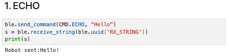

On the board, the ECHO case is handled as:

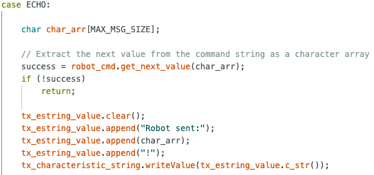

It is important to note that the tx_characteristic_string object on the Arduino corresponds to the same BLE characteristic, identified by a shared UUID, as RX_STRING on the Jupyter Notebook. This is how bluetooth communication is achieved. 

### Task 2: Three floats 

The computer issues a ``SEND_THREE_FLOATS`` command with three floats separated by a ``|``. 

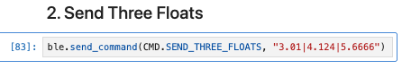

The board parses this string using the ``RobotCommand`` class in the format in the format ``<cmd_type>:<value1>|<value2>|<value3>`` and stores each value into a local float variable, which we print out.

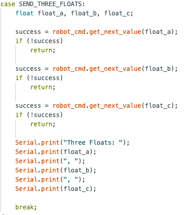


### Task 3: Get time in milliseconds 

We define a new command ``GET_TIME_MILLIS`` where the board returns the value of the number of milliseconds passed since the Arduino board began running the program.

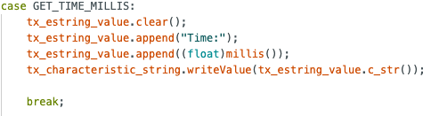

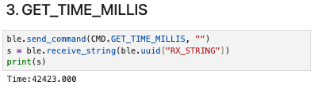

### Task 4: Notification handler 

A notification handler is tied to a characteristic, and any new value is automatically sent to the computer without the computer having to explicitly issue a receive command. 

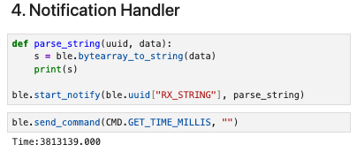

Note how the received string is printed automatically without having to call ``ble.receive_string`` and ``print()``.

### Task 5: Get time loop 

The command GET_TIME_LOOP sends the current time in milliseconds to the computer over a span of 2 seconds. 

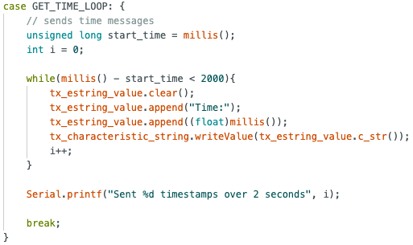

A total of 317 timestamps were sent over 2 seconds. 

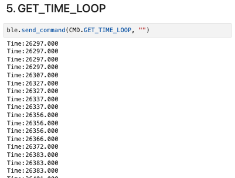

The effective data transfer rate of this method is 317/2 = _158.5 messages/s_

### Task 6: Store and Send 

The ```STORE_TIME``` command initiates a loop that records timestamps into a global array. A counter tracks the number of stored values to ensure the array does not exceed its allocated capacity of 100. 

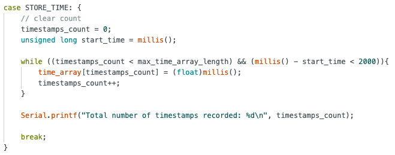

Next, the ```SEND_TIME_DATA``` command iterates through this array and sends each value to the computer. 

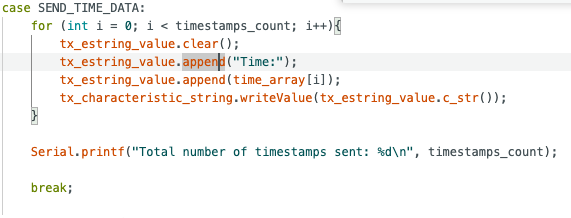

When both functions are called, we receive 100 timestamps.

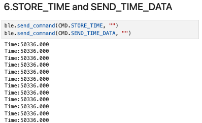

### Task 7: Temperature and Time 

To store both the temperature and time data, we use a similar approach to the previous task and create 2 commands. 

For each iteration of the for loop in ```STORE_TEMP```, we index into both the time_array and the temp_array and record the current time and temperature. As we use the same index, we can be sure that each element in both arrays correspond. 

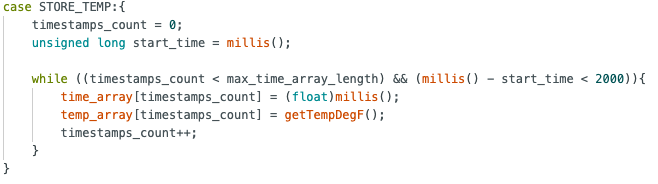

The ```GET_TEMP_READINGS``` command sends each temperature and time pair as a single string to the computer.

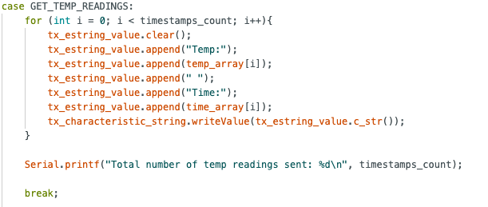

For the Jupyter notebook, we define a new notification handler for the RX_STRING characteristic. The ```parse_temp_readings``` callback splits the string and extracts the time and temperature to store in corresponding lists. 

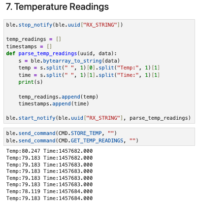

### Task 8: Streaming vs Buffering

In task 6 and 7, we explored different methods to transmit data. 

Task 6 streams data, which has the advantage of providing real-time data to the computer for applications that require immediate feedback or closed-loop control. 

However, the disadvantage of streaming is that its sampling rate is limited by the throughput of the BLE link. In our case, we recorded a throughput of 158.5 messages/s. If additional sensor data such as the IMU were streamed simultaneously, the available bandwidth would need to be shared across multiple data sources, which further reduces the effective sampling rate. 

In task 7, we buffered time data and stored them in an array before sending them to the computer. In this case, we recorded 100 timestamps in 3 milliseconds, which is roughly 33,333 datapoints/s. 

The buffering approach allows the Artemis board to record data significantly faster because data collection is no longer constrained by BLE throughput. Instead, the microcontroller can log data at the maximum rate permitted by the execution speed of the loop and memory access, making this method advantageous for high-frequency data acquisition.

On the downside, buffering introduces latency since data is only available after the full array has been recorded by the board. Additionally, buffering is constrained by the available RAM on the board, so prolonged high-rate logging can quickly exhaust memory.

The Artemis has 384kB RAM, which is 393,216 bytes (1kB = 1024 bytes). Time data is recorded as a float, which takes up 4 bytes of memory. Theoretically, the board can store a maximum of 393216/4 = 98304 timestamp entries, though the actual number is lower due to memory reserved for the program, stack, and other operations.

## Additional Tasks for ECE 5160

### Task 1: Effective Data Rate and Overhead 
To measure the round trip time of different packet sizes, we create a command ```RTT_TEST``` with an argument that specifies the payload size of the reply. 

Upon receiving the command, the board creates a packet of specified size, and sends the packet back to the computer. 

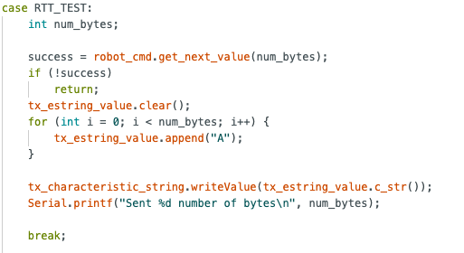

To measure RTT, we simply record the time at which this command was sent (_t_sent_) and the time which the reply was received by our notification handler(_t_recv_). 

RTT = _t_recv_ - _t_sent_

Data Rate = N / RTT, where N is the payload size in bytes. 

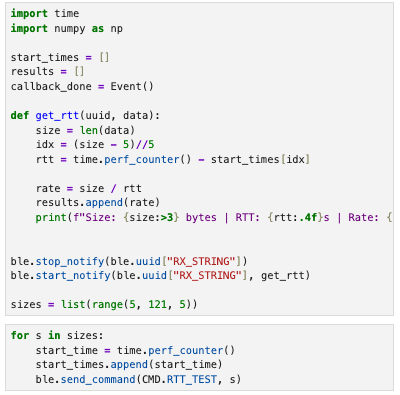

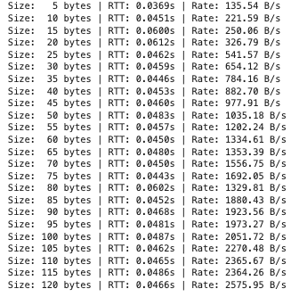
Then, we can plot a graph of Data Rate against Payload size to better analyze the data. 

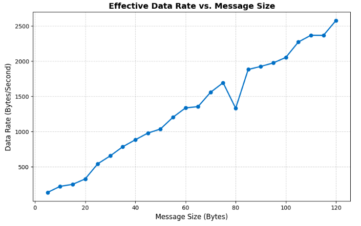

From the graph, we observe that the effective data rate generally increases as the message size increases.

Small packets introduce substantial overhead from BLE protocol headers and processing latency on both the computer and the board. These delays are fixed costs that occur regardless of payload size, so they dominate the total transmission time for small packets, resulting in low effective data rate. 

Larger replies amortize this fixed cost over more payload bytes, which improved throughput. This explains the steady rise in effective data rate observed in the plot. A 5-byte reply has a data rate of ~136 bytes/s, whereas a 120-byte reply has a data rate of ~2576 bytes/s, nearly 19x higher throughput.  

This experiment demonstrates that it is more efficient to transmit data in larger chunks rather than many small packets. Grouping data into bigger replies reduces the relative impact of per-packet overhead and makes better use of the available BLE bandwidth.

### Task 2: Reliability 
To evaluate the reliability of the BLE connection under high transmission rates, 1000 packets, each containing a 1-byte payload, were transmitted consecutively from the board to the computer.

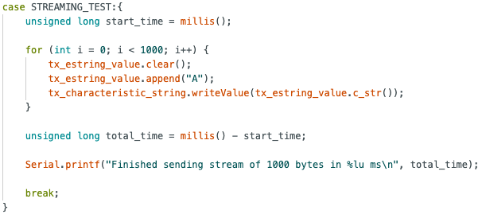


Data was sent at about 144 packets/second. 

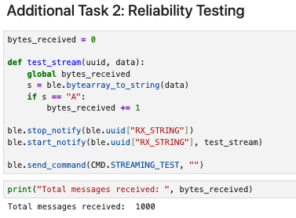

The callback function adds to a running count only if the data received from the ```RX_STRING``` characteristic matches the expected value ```"A"```, ensuring that only valid packets are counted. As shown by the total messages received, all 1000 packets were successfully detected, indicating that no packets were lost during transmission and that the BLE connection remained reliable even at a data rate of 144 packets/s.

## Discussion

In this lab, I learnt the fundamentals of establishing a BLE connection between a computer and an Artemis board, including how to transmit commands, set up notification handlers, and publish data to a characteristic. One challenge was accurately measuring the round trip time (RTT), as asynchronous callbacks made it difficult to determine the precise moment a response was received. This was addressed by recording timestamps to an array before sending a command and calculating the RTT within the notification callback.

Overall, the lab provided practical insight into BLE communication and set up a good foundation for future work with the robot car. 


