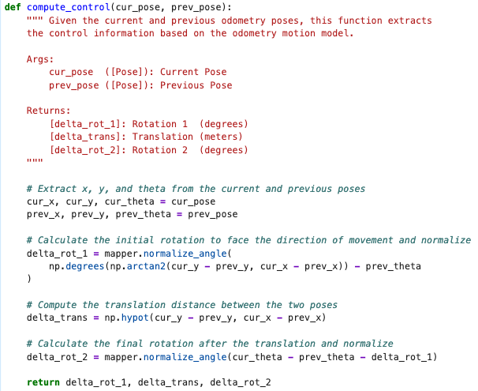
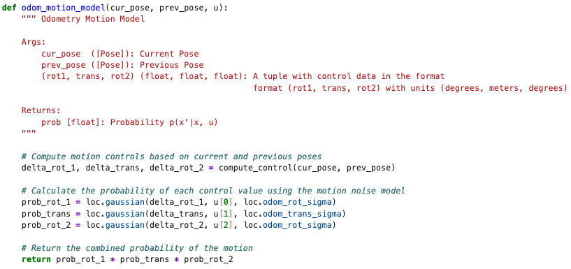
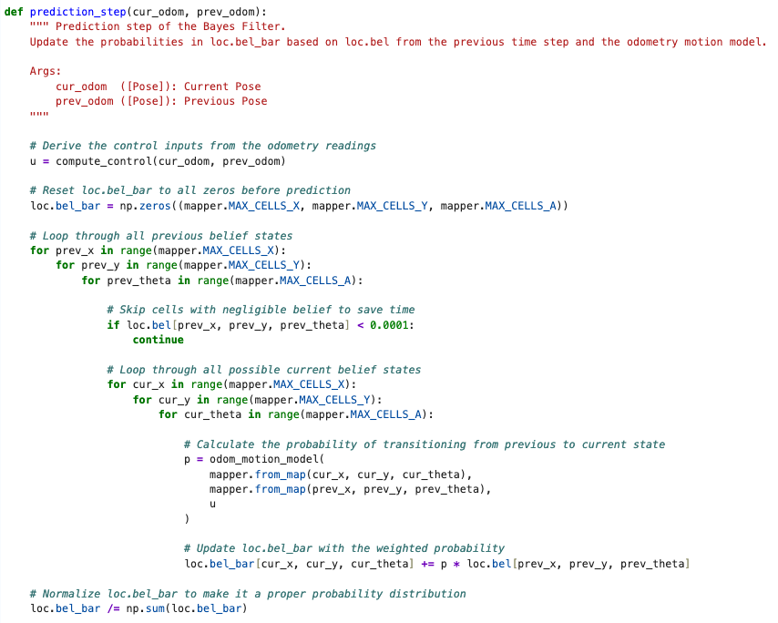
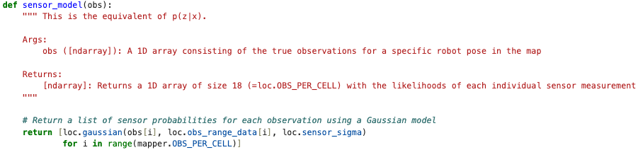
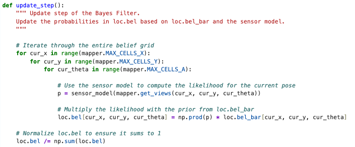

In this lab, we implement a Bayes Filter for Robot Localization.

### Compute Control 
An odometry pose of (x, y, yaw) represents the robot's state. Given the current pose and the previous pose, we can deduce the control input: rotation 1, translation, and rotation 2.

  

### Odometry Motion Model 
We use the compute control function to get the control data, but there is inherent noise in the data that we need to model, which we use the Gaussian Distribution for. This is given to us as a method in the BaseLocalization class. 

  

### Prediction Step
We call the prediction step when we have no new sensor data but need a best guess of where the robot currently is. Given the prior belief `loc.bel` and the control input derived from odometry, the prediction step computes an updated prior `loc.bel_bar`. 

For each previous grid cell with non-negligible belief, we evaluate the odometry motion model to get the transition probability to every possible current cell, and accumulate the weighted sum. The equation is:

$$\bar{bel}(x_t) = \sum_{x_{t-1}} p(x_t \mid u_t, x_{t-1}) \cdot bel(x_{t-1})$$

  

After all transitions are accumulated, `loc.bel_bar` is normalized to ensure the probabilities sum to 1. 

### Sensor Model
Given a set of 18 ground truth distance measurements stored in the map for a specific grid cell, the sensor model evaluates how likely the robot's actual sensor readings are (given by loc.obs_range_data) if it were at that pose. 

  

### Update Step
Finally, we can call the update step when we have new sensor data to update the prior belief. 

For each grid cell, the 18 sensor likelihoods from the sensor model are multiplied together and weighted by the predicted belief:

$$bel(x_t) = \eta \cdot p(z_t \mid x_t) \cdot \bar{bel}(x_t)$$

  

The result is normalized to sum to 1. Cells that do not match the sensor data get updated to a lower probability, while cells that do match get a higher one.

### Simulation 
A video of the Bayes Filter in action is shown below. 

  <iframe width="560" height="315"
    src="https://www.youtube.com/embed/C1Qz19R3J58"
    title="Stunt"
    frameborder="0"
    allowfullscreen>
  </iframe>

The green path depicts the ground truth position, the blue path being the belief (from Bayes filter), and the red path is the predicted position based purely on odometry. 

We can see that the belief path matches the ground truth path much more closely than the odometry, which shows that the Bayes filter is able to correct for the noise in the odometry readings. 

### References 
I referred to Trevor Dales and Jack Long's writeup to better understand how to implement the code for this lab. Thank you!