

In this lab, we run the Bayes filter on our robot. 

### Simulation Check 
To test that all the Bayes filter works, I ran the simulation from lab 10 once more. 

  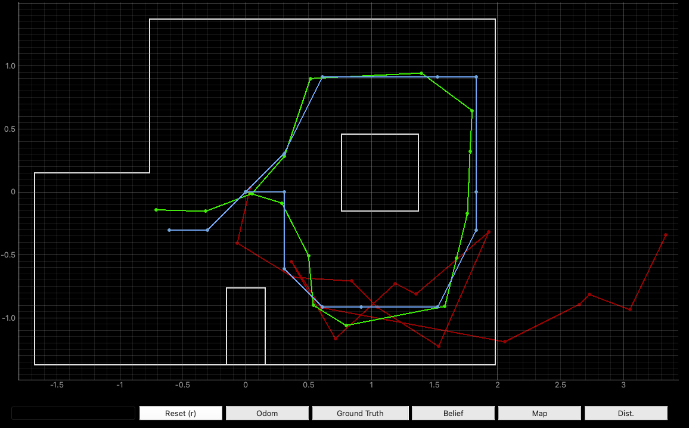

The blue(belief) and green(ground truth) track each other quite well, which told me that there were no issues with the simulator and filter. 

### Arduino Code
For the robot to perform a 360 degree turn at 20 degree increments and send ToF data, I used the same ROTATE_TOF command in lab 9. 

However, I noticed in lab 9 that the robot would make CW turns because its internal yaw coordinate system was horizontally mirrored to that of the world. Therefore, instead of incrementing by 20 degrees, I decremented the target angle by 20 degrees to achieve CCW rotation. This saves some time because we can use the values directly sent by the Artemis for the filter. 

### RealRobot Class
The `perform_observation_loop()` method in the RealRobot class calls on the robot to make a full turn and returns an 18-length array of the ToF values recorded. 

In this method, I first set the PID gains and any other control variables that the robot requires for the on-axis turn. 

  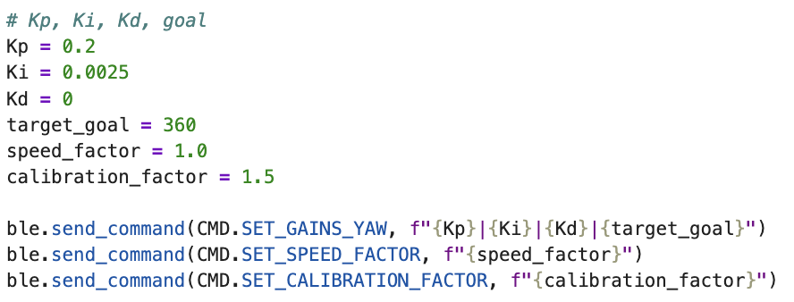

Next, I call the ROTATE_TOF command and wait for 60 seconds. It was important that this wait was implemented with an asyncio sleep, and not a blocking sleep (e.g. `time.sleep`) because the Artemis transmits ToF values over BLE notifications during the rotation, and the notification callbacks need the event loop to be running in order to fire. 

  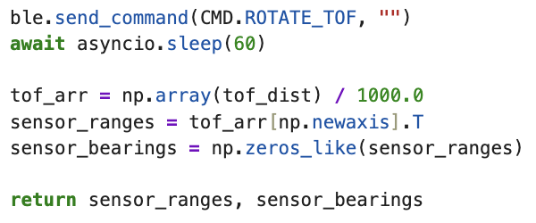

### Localization Results 
With the RealRobot class implemented, we can run `perform_observation_loop()` to get sensor values and run the update step of the Bayes filter.

I made sure to position the robot facing the world +x axis at the start of the rotation (so 0 degrees). 

#### (5,3) Results

  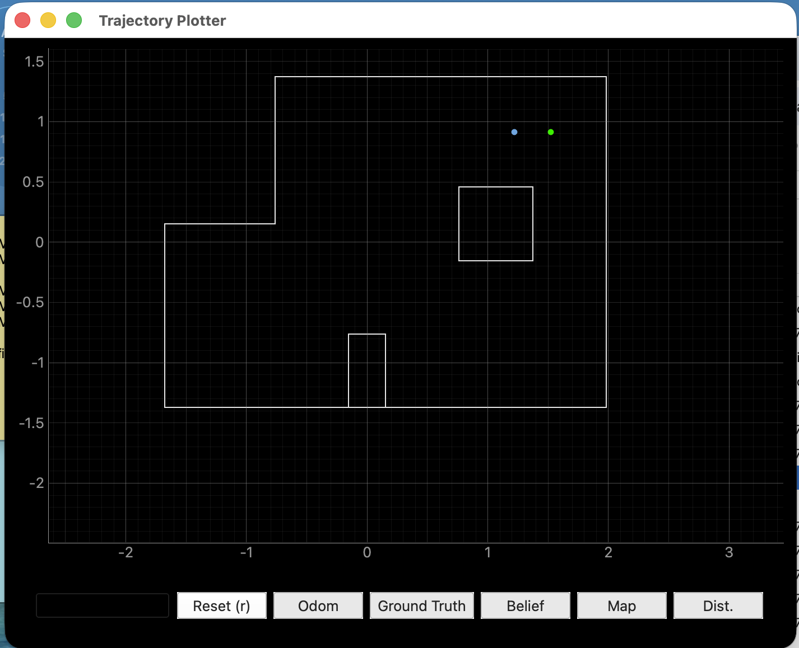

  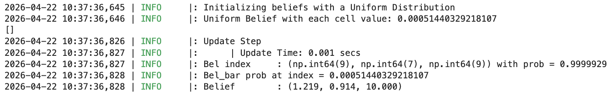

The belief returned with a very high probability (0.9999...), indicating that the update step was highly confident in the robot's position based on the sensor values. 

However, this is not exactly true since the belief was about 0.3 meters away from the ground truth. Therefore I decided to tune the _sensor_sigma_ value. 

  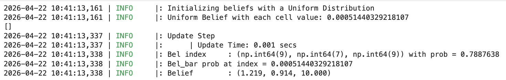

Increasing _sensor_sigma_ from 0.1 to 0.3 yields a lower confidence about 0.788. I first expected that tuning _sensor_sigma_ would change the position of the belief, but it stayed the same. I realised that _sensor_sigma_ only controls how sharply peaked the gaussian is around each cell, so the argmax location remains unchanged. 

However, I think that this new belief confidence better reflects what I observed, so I chose to stick with _sensor_sigma_ = 0.3 for the rest of my readings. 

#### (5,-3) Results

  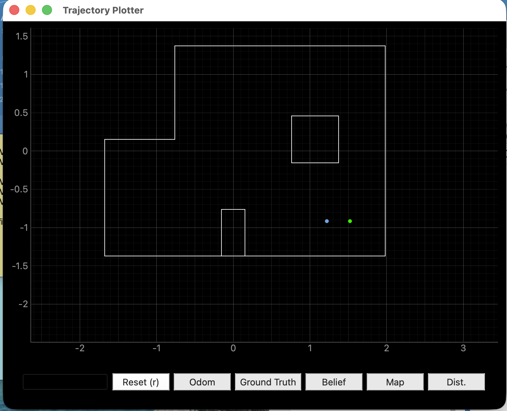

  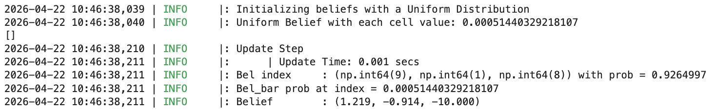

Again, the belief was about 0.3 meters horizontally away from the ground truth and the y-coordinate was the same (-0.914). This signalled to me that there could be a systemic offset in my readings, and I suspect that this could be due to the robot not turning exactly on axis. 

I noticed this in lab 9 and calculated that total error caused by this could be from 21–36cm, which is consistent with this observation. 

#### (0, 3) Results

  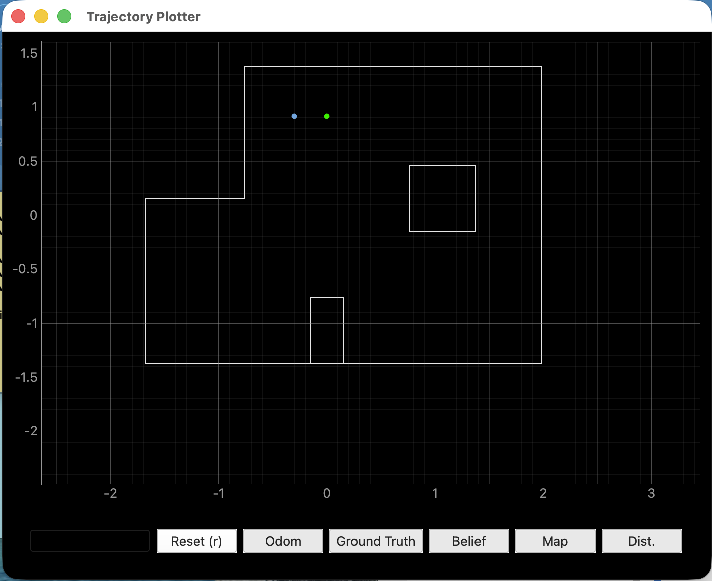

  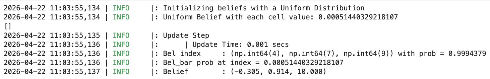

Similarly, the (0,3) plot shows the belief 0.3 meters away from the ground truth. 

#### (-3, -2) Results 

  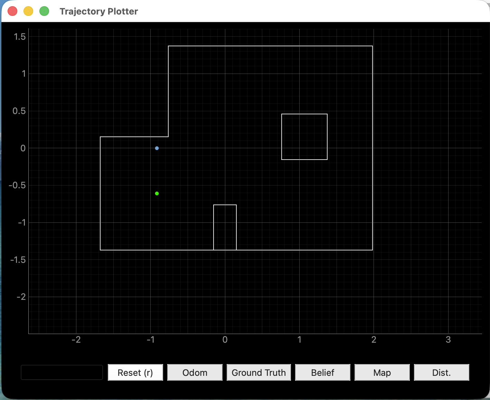

  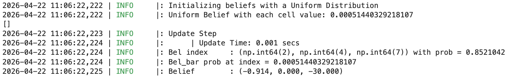

The (-3, -2) coordinate shows a larger error between belief and ground truth positions, where the belief is much closer to the wall. The robot did not localize very well here, which I suspect is due to the large open area in that part of the map. The ToF values there are large and noisy, giving the filter less accurate values to work with. 

### Conclusion 

In general, the Bayes filter works quite well and I was surprised that the belief and ground truth positions match well. There is a systemic error of roughly +/-0.3m along the x-axis, which I suspect is due to the robot not turning exactly on axis. The robot also localizes better in more enclosed spaces where the ToF returns smaller and less noisy values. 

