

In this lab, I programmed my robot to navigate through a set of waypoints in an arena. 

### Approach 1: Using Localization Tools 
My first plan was to use the localization tools built up in Lab 11 to localize the robot at each setpoint. The control flow I wrote was:

1. Run the update step of the Bayes Filter to get belief. 

2. Based on x, y from the belief, compute the target heading and turn the robot using yaw PID control. 

3. After turning, take a ToF reading at the current position. Then, subtract the straight-line distance between the current belief position and the next waypoint to determine how far the robot needs to be from the wall. This value is _target distance_ that the linear PID runs on.

Repeated for each set point. I ran this control loop, and you can see the (sped-up) video shown below.

  <iframe width="560" height="315"
    src="https://www.youtube.com/embed/Ps7L5IWh7Hk"
    title="Stunt"
    frameborder="0"
    allowfullscreen>
  </iframe>

For the first 3 setpoints, the localization works well and the belief produced is close to where the robot actually is. In fact, the movement from point 3 to 4 is completed successfuly even though the path is a tight squeeze, blocked by two of the walls. 

  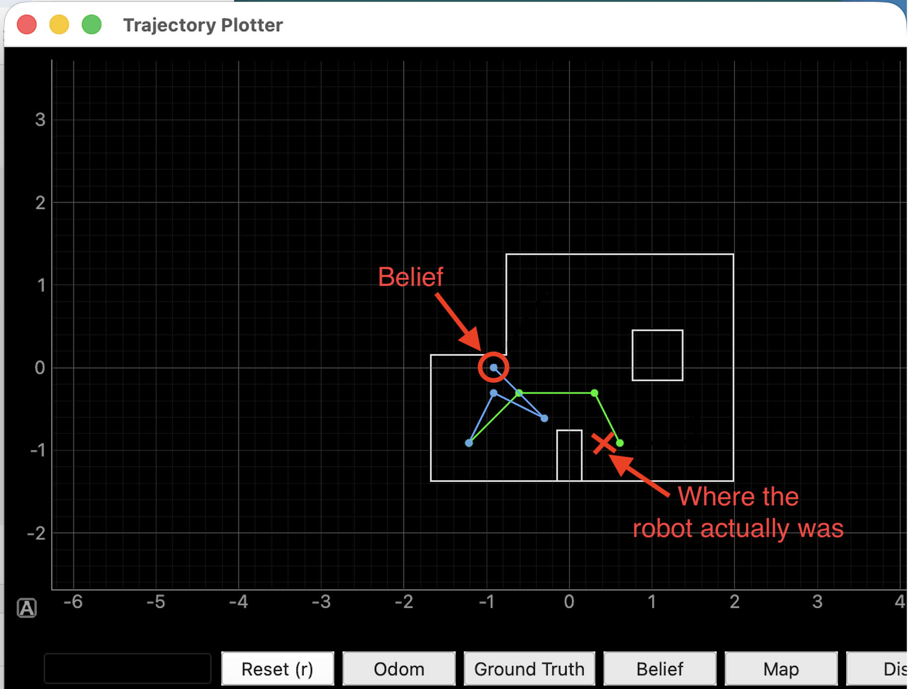

However, the localization at point 4 is very inaccurate. The belief returned by the Bayes filter shows the robot at a completely different part of the arena. The _target distance_ is now negative due to this error, which throws an unbounded error for the linear PID control.

Another issue was that running the update step at every setpoint was very time consuming. Each 360 degree rotation took about 2 minutes, which was a big price to pay to improve localization accuracy. 

To circumvent the timing issue, I decided to run the update step every other setpoint. However, this did not fix the issue of erraneous belief coordinates (see two examples below).

  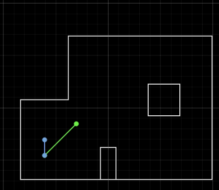
  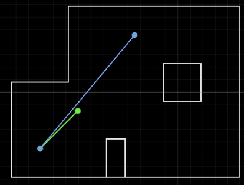

I did not expect to have such a big error in my belief estimate, because my robot localized quite well (within ~0.3m of ground truth) in Lab 11. Furthermore, the errors were very non-deterministic. Running identical code from the same position would frequently yield two substantially different belief estimates. 

One reason for these errors could be due to the large variance from large ToF values. With the robot at the bottom left corner of the arena and pointing towards the upper right, ToF values can range wildly from 2600mm to 3800mm. 

I tried adjusting the ToF sensor angle and applying a low-pass filter, but repeated runs still produced erroneous predictions. Since even a single bad belief estimate can derail the entire navigation, I opted to move away from closed-loop control in favor of hitting more set points reliably.

### Approach 2: Open Loop Control 
My second plan was to directly program the robot's path using a sequence of open-loop, turn-go-turn commands. 

#### Top Level
A top level view of my system design is shown below:

  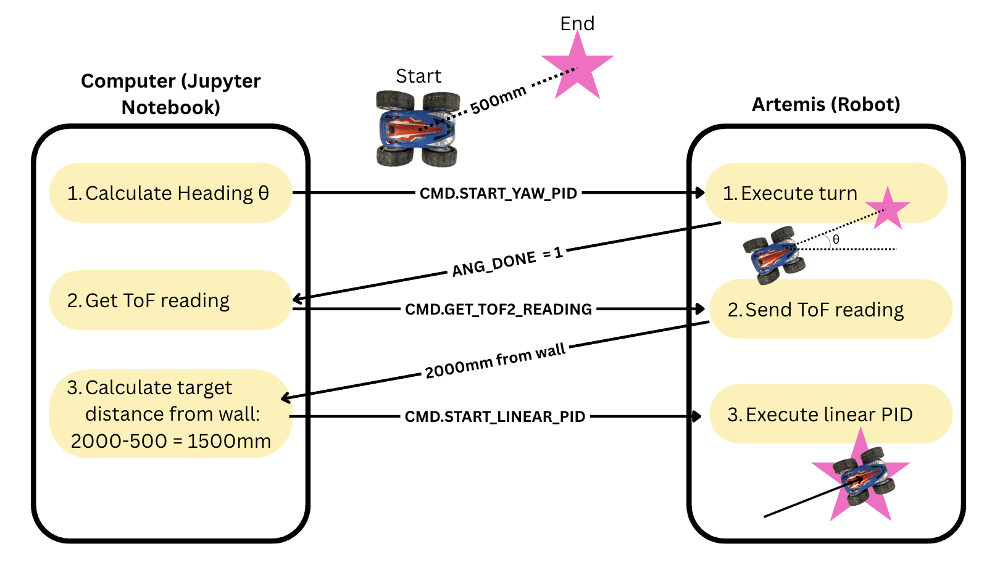

#### Code and Implementation

First, the angle between 2 points are calculated using the ``target_angle`` function. 

  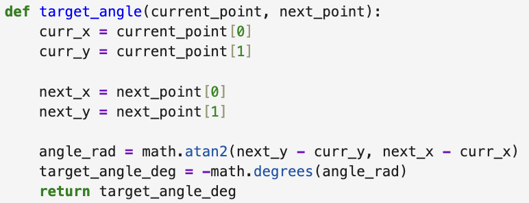

Note that the +x axis of the arena (stretching from left to right) is taken as the 0° reference, with angles increasing counter-clockwise. However, the IMU's yaw output is horizontally flipped, so the target angle is negated.

Then, Yaw PID is executed so the robot turns to face the next point. 

  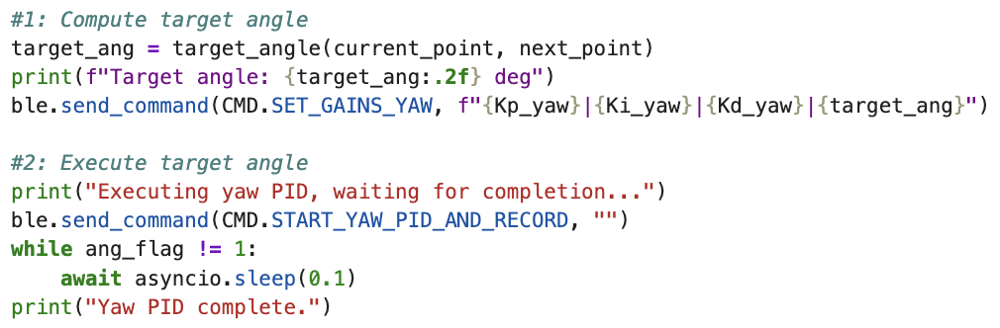

After turning, the robot takes a ToF measurement at this angle. To reduce the variance of these measurements, this command returns the average of 3 independent ToF readings.

  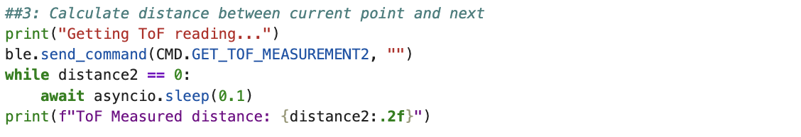

The ``distance_between_2_points`` function calculates the distance between 2 given set points in millimeters. 

  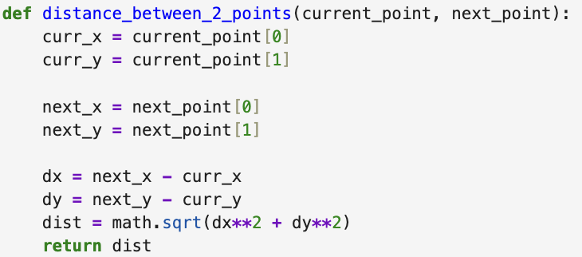

We subtract this distance from the ToF measurement to obtain the target stopping distance, i.e. how far the wall ahead should be when the robot has reached the next waypoint. Then, we run the linear PID. 

  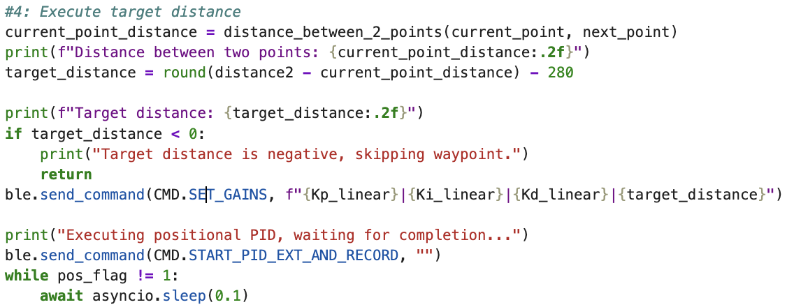

I added flags to signal when the linear and yaw PID were complete. The stopping criteria were: 
1. Yaw: Absolute error smaller than 3 degrees, and angular position has been held for more than 3 seconds. 
2. Linear: Absolute error smaller than 50mm, and time since loop start is more than 5 seconds. 

I also tried a position-held criteria for the linear loop (similar to yaw), but the large variance in ToF readings made this unreliable. Even when the robot was physically stationary, small fluctuations in the sensor output caused the error to drift below and above of the threshold, preventing the loop from ever finishing.

The code above is encapsulated in a ``path_planning`` function, which is called 8 times in a loop to navigate through all 9 waypoints.

  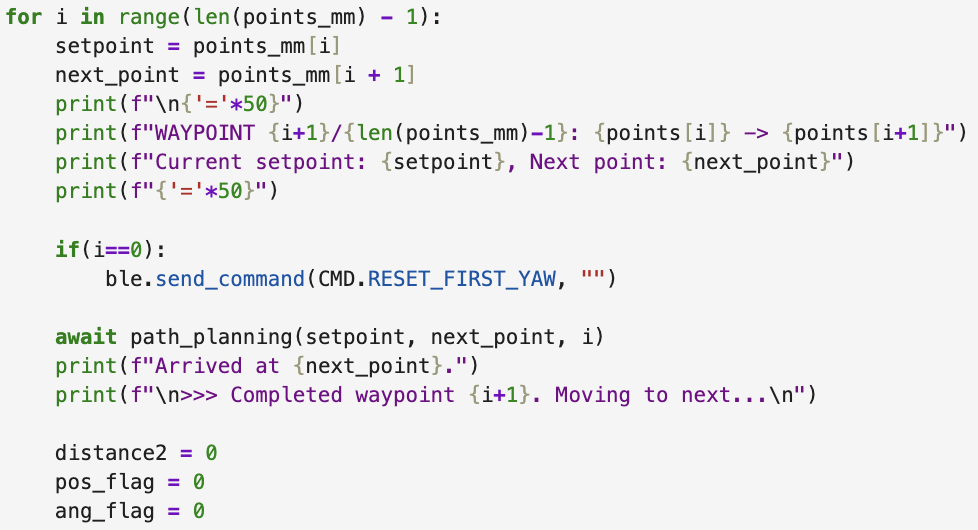

#### Video
A successful run is shown below:

  <iframe width="560" height="315"
    src="https://www.youtube.com/embed/MsCtsgftQP4"
    title="Stunt"
    frameborder="0"
    allowfullscreen>
  </iframe>

The logs printed during running are:

  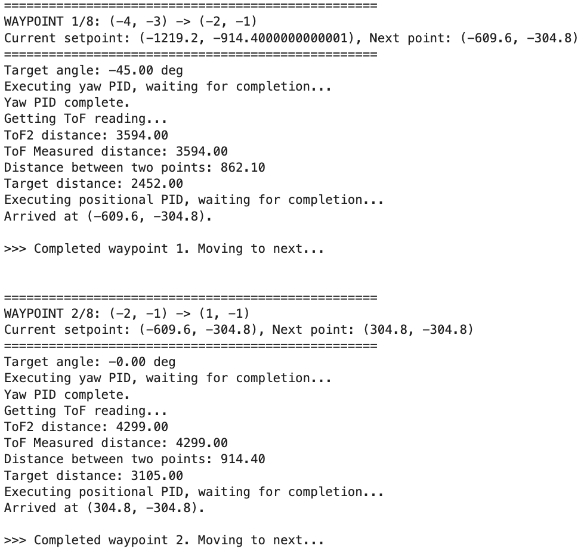

#### Evaluation 
In general, the open loop control works well, and the robot navigates successfully around the arena. It hits all set points except the final one (0,0). The robot does not end up exactly at each setpoint, instead ending up around 30 centimeters away from each spot. An entire run is completed in about 1.5 minutes. 

A big drawback of this open loop control strategy is the lack of positional feedback. The system has no way of knowing the robot's actual location in the arena, and as such any errors would be propagated form one way point to another. This is observed between setpoints 
5 and 6 (setpoint 6 is just 1ft above setpoint 5). Because the robot simply assumes it has reached its target upon completing each movement command, it treats its stopping point as set point 5. It then moves 1 foot upward from that incorrect position, causing it to overshoot and miss set point 6 by half a foot.

#### Conclusion
This lab was one of the harder labs for me in this course, especially because it ties everything we worked on in previous labs together. For previous labs, each element was executed in isolation, but in this one, elements were chained one after another, meaning any failure along the way could throw off the entire run. 

I had to go back to the drawing board many times, tuning PID parameters and even the two motor calibrations so that the robot could move precisely enough to complete a full run. If I had more time, I would continue working on a closed-loop design and perhaps integrate some kind of decision tree between the belief confidence and the open-loop fallback, switching between the two depending on how confident the belief estimate is.

