## Lab 2:

### Task 1: Set up IMU 

The IMU used in this lab is the ICM-20948, with a three axis gyroscope, accelerometer and magnetometer. 

  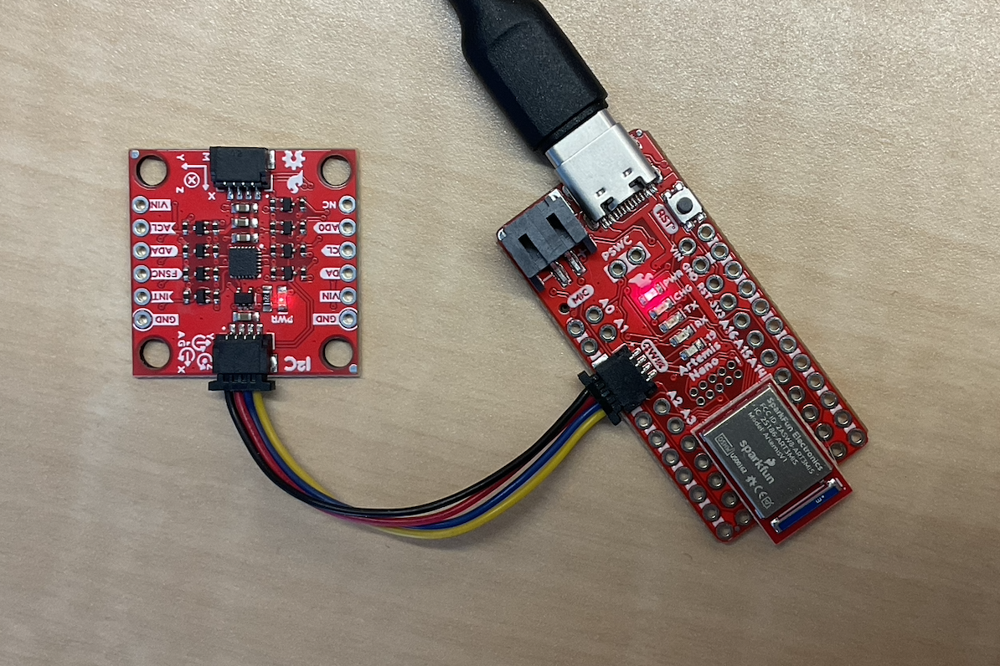

AD0_VAL specifies the least significant bit of the IMU’s 7-bit I2C address. The default value is 1 because the AD0 pin is pulled high. It should be set to 0 only if the ADR jumper is soldered, which ties the pin to ground and changes the device address.

Below is the Serial Monitor output from the Example1_Basic sketch:

  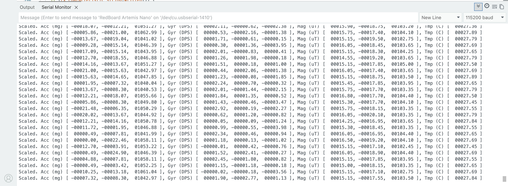

3 sets of data corresponding to gyroscope, accelerometer and magnetometer are printed. This screenshot was taken when the IMU was laid flat on the table, which corresponds to the near 0 values for _a_x_ and _a_y_. The measured _a_z_ value is approximately +1g, which is the upward normal force on the sensor when it is stationary on the table. 

Similarly, the gyroscope values indicate near-zero angular velocity about all three axes, consistent with the IMU being at rest.

### Task 2: Accelerometer 

Pitch and Roll are calculated with these equations: 

  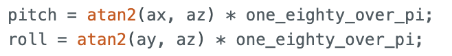

We use atan2() as it uses the signs of both readings to determine the correct quadrant that the angle lies in. 

Pitch and Roll values at -90, 0, 90 are:

<table>
  <tr>
    <td colspan="2" align="center">
      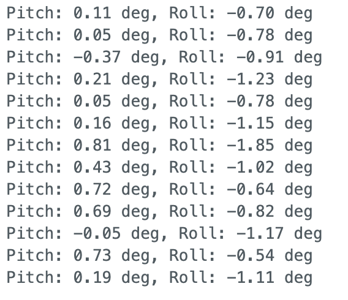 
      0 degree Pitch and Roll
    </td>
  </tr>
  <tr>
    <td align="center">
      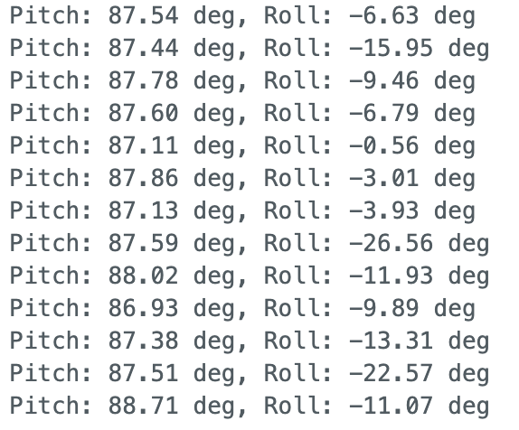 
      90 degree Pitch
    </td>
    <td align="center">
      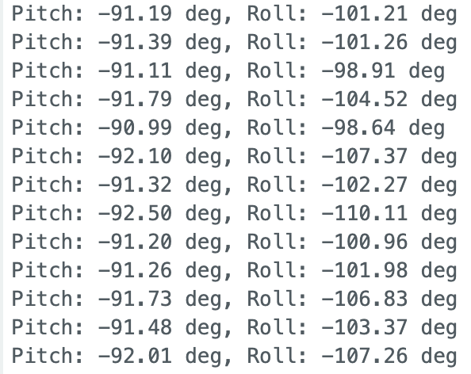 
      -90 degree Pitch
    </td>
  </tr>
  <tr>
    <td align="center">
      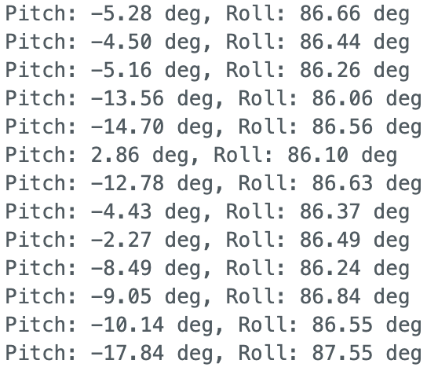 
      90 degree Roll
    </td>
    <td align="center">
      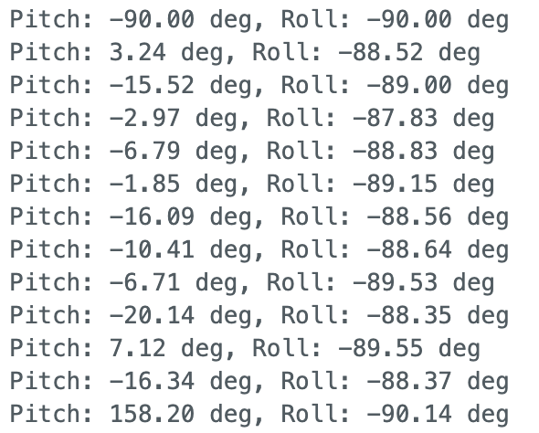 
      -90 degree Roll
    </td>
  </tr>
</table>

There are small discrepancies in the calculated pitch and roll values (not exactly 0/90/-90), so we perform two point calibration to reduce this error. 

We measure the mean pitch and roll values recorded at -90° and +90°, then compute a 2-point linear calibration of the form:

    angle_cal = scale * angle_raw + offset

Measured values:
- Pitch: $r_{-90}$ = -89.14 , $r_{+90}$  = 86.53
- Roll:  $r_{-90}$ = -88.38 , $r_{+90}$  = 85.223

Scale and Offset:

    pitch_cal = 1.0246 * pitch_raw + 1.34
    roll_cal = 1.0368 * roll_raw + 1.64

Now we observe more accurate pitch and roll readings:

  <iframe width="560" height="315"
    src="https://youtu.be/UTVPtDu3RzI?si=3wIHFu2NvPdfUONE"
    title="Stunt"
    frameborder="0"
    allowfullscreen>
  </iframe>

Similar to the buffering method implemented in Lab 1, we store 1000 sensor readings and send the data to the computer over BLE. 

  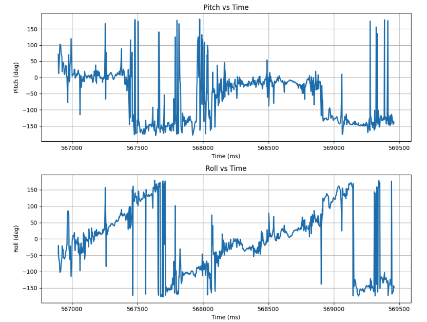

Pitch and roll values calculated from raw accelerometer data is noisy. We perform a frequency spectrum analysis to investigate the noise.

  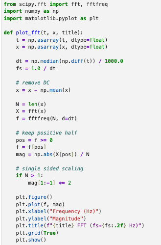

  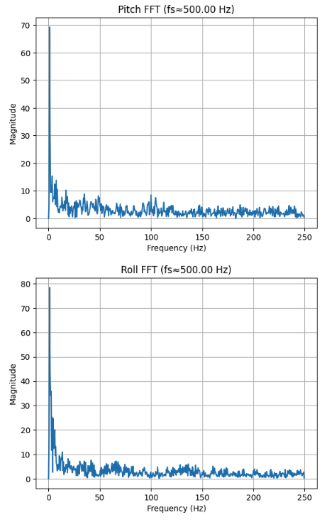

From the spectrum, most of the energy associated with noise appears at higher frequencies, while the useful signal is primarily within **0 to 5 Hz**, suggesting that a low-pass filter with cutoff frequency 5Hz would be a good choice. 

We calculate α using the sampling and cut-off frequency, and use it to generate a digital low pass filter.

  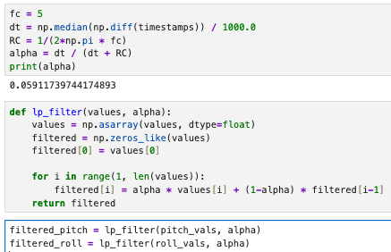

When we plot the raw vs filtered Pitch and Roll values, we observe a substantial decrease in noise. The angle plots are much smoother and the random peaks (due to noise) are ignored. 

  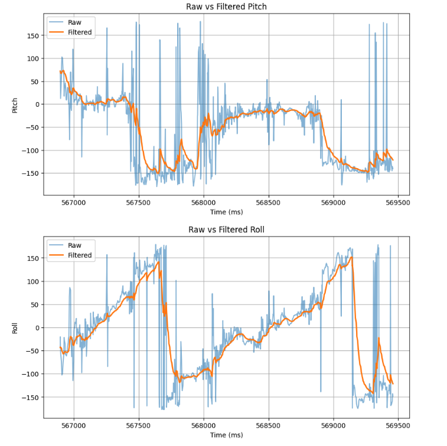

We introduce vibrational noise by gently tapping the table and observe the resulting FFT. Noticeable peaks appear at higher frequencies.

  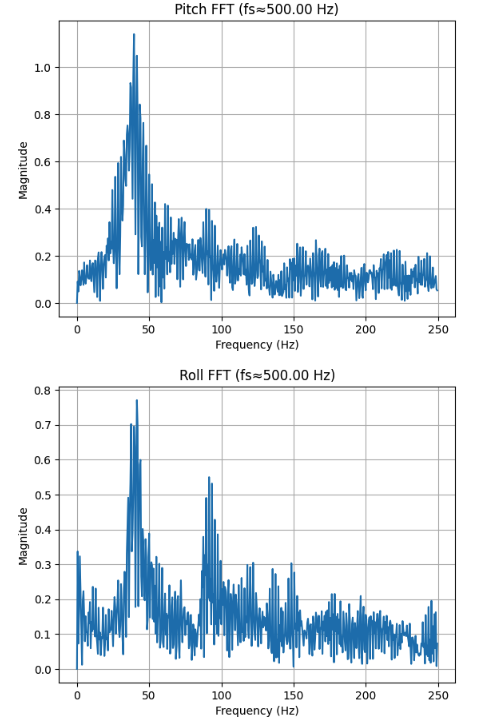

Our LPF is able to successfully attenuate high-frequency noise, and the filtered pitch and roll converge to approximately 0°.

  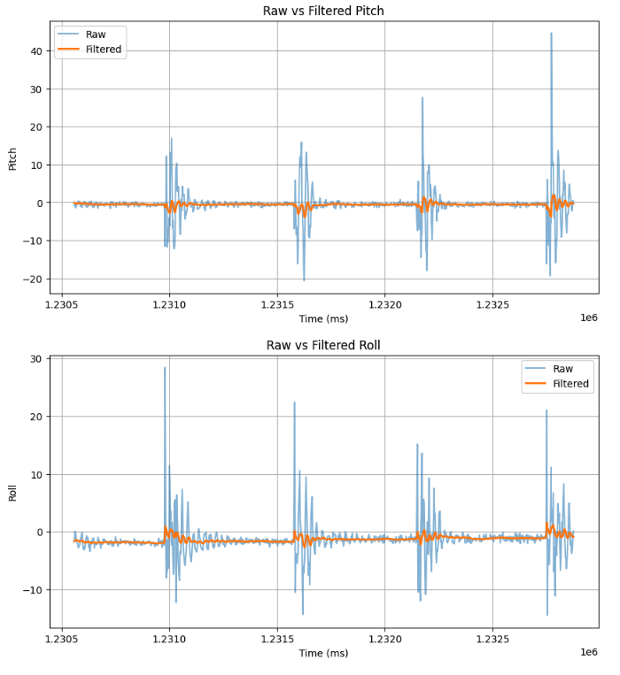

### Task 3: Gyroscope
Pitch, Roll and Yaw angle values from the Gyroscope readings are calculated using:

  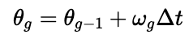

Implemented in code:

  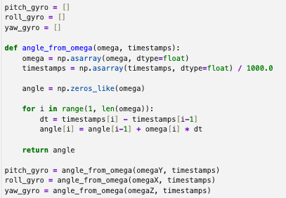

Plot of pitch, roll, and yaw as IMU was rotated in order of Z, X, Y axis:

  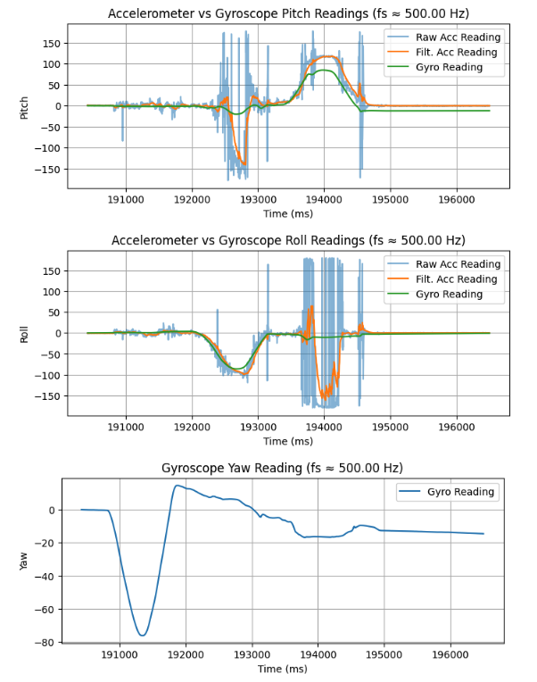

The angles derived from gyroscope readings accurately track rapid changes in orientation with minimal noise. In the roll graph, the accelerometer shows a negative dip while the gyroscope remains near zero because the IMU is rotating about the Y axis (pitch), which introduces linear acceleration that corrupts the accelerometer-based roll estimate. 

However, the gyroscope suffers from drift. Despite the IMU bring stationary, the angles calculated increase with time due to the accumulation of small bias errors during integration.

  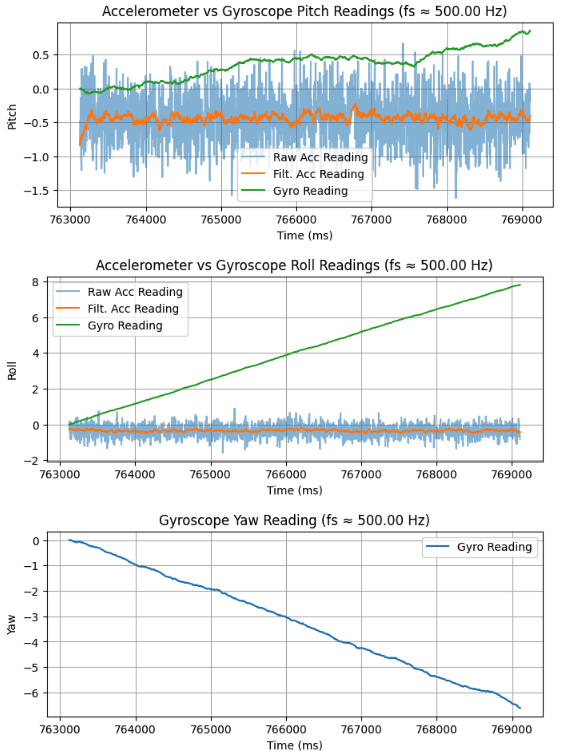

The above plots demonstrate that the accelerometer and gyroscope exhibit complementary characteristics. The accelerometer provides a stable long-term reference but becomes unreliable during dynamic motion, while the gyroscope accurately captures short-term rotational changes yet accumulates drift over time. 

As such, we design a complementary filter:

  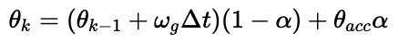

  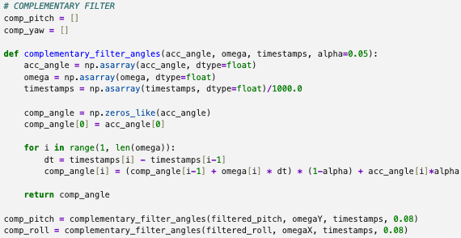

Increasing α means that we place greater weight on the accelerometer measurement and less on the gyro. After playing around with different values of α, I found that a value of _0.05_ gave a plot that follows the gyroscope during rapid motion while still converging back toward zero when the IMU is at rest.  

  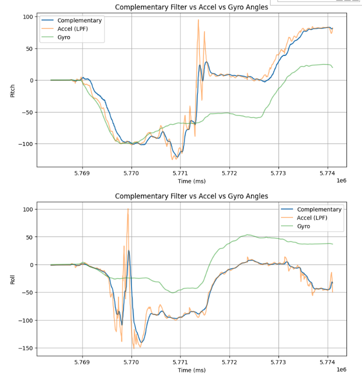

### Task 4: Sampling

A new case SET_RECORD controls the flag to start recording (record_main).

  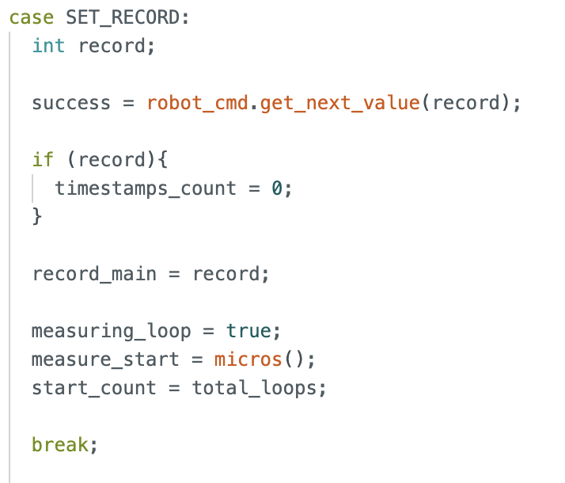

Data collection is handled in the main loop. Instead of waiting for data to be ready, the code skips over the current loop if data is not ready. Extra logic is used to ensure data is only recorded when record_main is true, and when the array is not yet full.

  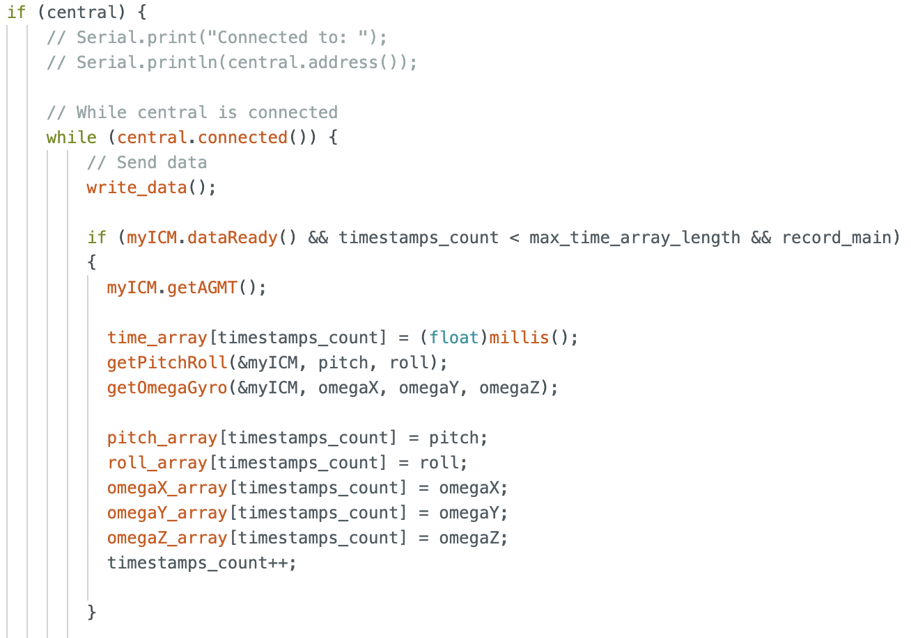

A second GET_READINGS command starts data transmission from board to computer. Data is sampled at a rate of roughly 329.5Hz.

A running count _total_loop_ is incremented each time the main loop is run. The measurement loop starts when the board receives the SET_RECORD command. At the end of 5 seconds, we calculate the frequency of the main loop using loops_elapsed/5.0. 

  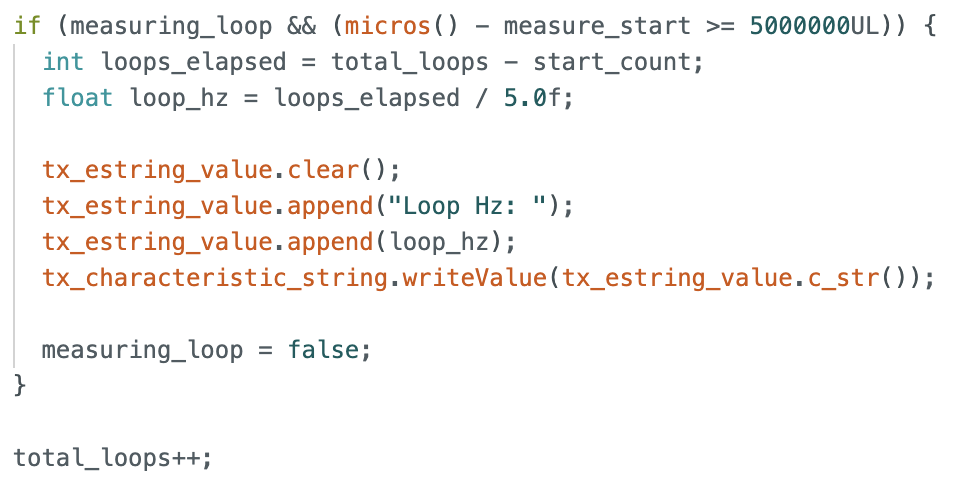

The main loop of the Arduino runs at roughly 2383.0Hz, 7x faster than the IMU produces new values. 

In this lab, I chose to have separate arrays for storing Accelerometer and Gyroscope data. This method is more organized and code is more readable, especially when sending data over BLE.

Floats were used because the IMU returns floating point values, and the -$\pi$ to $\pi$ angle range requires sufficient precision to avoid quantization errors. Floats are also 4 bytes, which are memory efficient when compared to strings and doubles. 

My program uses 6 arrays: time, pitch, roll (from accelerometer), omegaX, Y, Z (from gyroscope). Setting each of them to length 5000 gives a compile time message:

  

Assuming all remaining 227920 bytes are all allocated to these arrays, each array could be ~9496 values larger, which means a maximum array length of 14496. A sampling rate of 329Hz means it would take ~43.86 seconds to fill these arrays.

Recording 5000 readings corresponds to approximately 18 seconds of raw sensor data, which the plot below shows:

  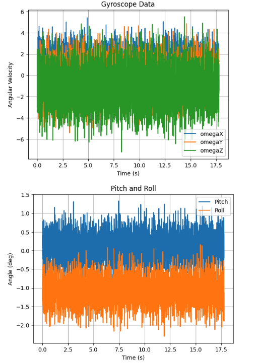

### Task 5: Stunts

  <iframe width="560" height="315"
    src="https://www.youtube.com/embed/9JmRxtrYF88"
    title="Stunt"
    frameborder="0"
    allowfullscreen>
  </iframe>

The car reacts quickly and accelerates rapidly once commanded by the controller. It is able to turn on the spot if the right button is held down, but it often catches an edge and flips. 

