## Lab 3:

### Prelab: 

In this lab we evaluate a VL53L1X Time-of-Flight sensor. This sensor has a default I2C address of 0x52. 2 ToF sensors are used to record distances from the car to its surroundings. Each sensor has a maximum range of 4 meters and field-of-view of 27 degrees. 

Given these constraints, I chose to mount one sensor at the front of the car to detect obstacles directly ahead, and place the second on the side to provide lateral distance measurements for trajectory control. A potential drawback of this sensor placement is that the robot is unable to detect any obstacles behind it. 

The wiring diagram is shown below:

<div style="text-align: center;">
  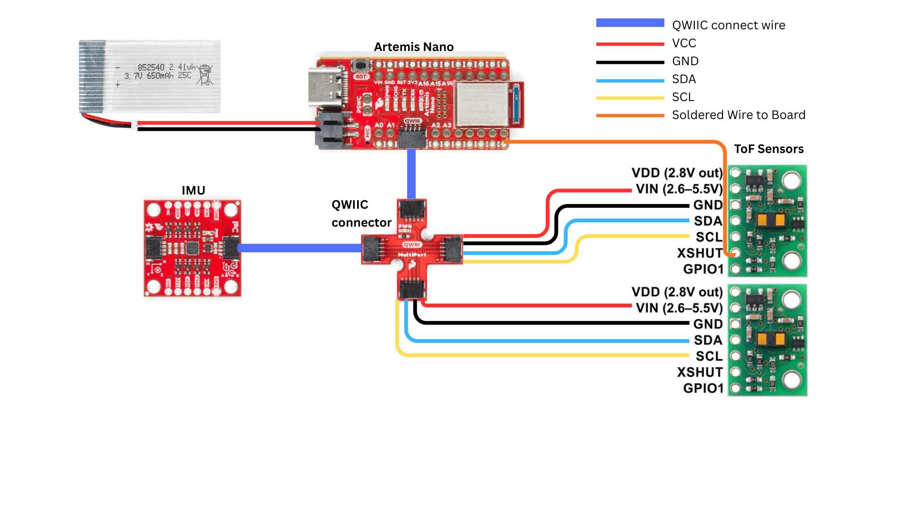
</div>

An extra wire connects a ToF sensor's XSHUT input to pin A1 on the artemis board, so we can program a different address for one of the ToF sensors. 

### Soldering: 

Soldering a JST connector to a 650mAh battery allowed me to power the Artemis with a battery. I also soldered the ToF sensors to the QWIIC cables. 

<div style="text-align: center;">
  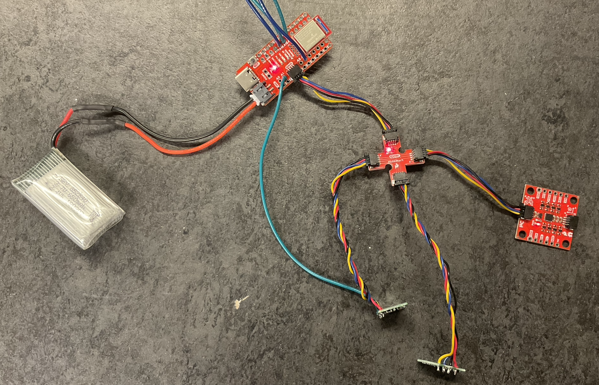
</div>

### Scan for Address: 

Next, I ran the Example05_wire_I2C to scan for the ToF address. 
<div style="text-align: center;">
  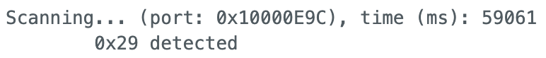
</div>

The scan revealed a detected address of 0x29(0b00101001), instead of the default 0x52(0b01010010) address. This is because 0x52 is the 8-bit address, where the last bit indicates read or write mode. Removing that bit gives the actual 7-bit address: 0x29.

### Sensor Testing: 

The ToF sensor has 3 modes: short, medium, and long. I decided to test short and long mode since medium requires another library to be installed. 

<div style="text-align: center;">
  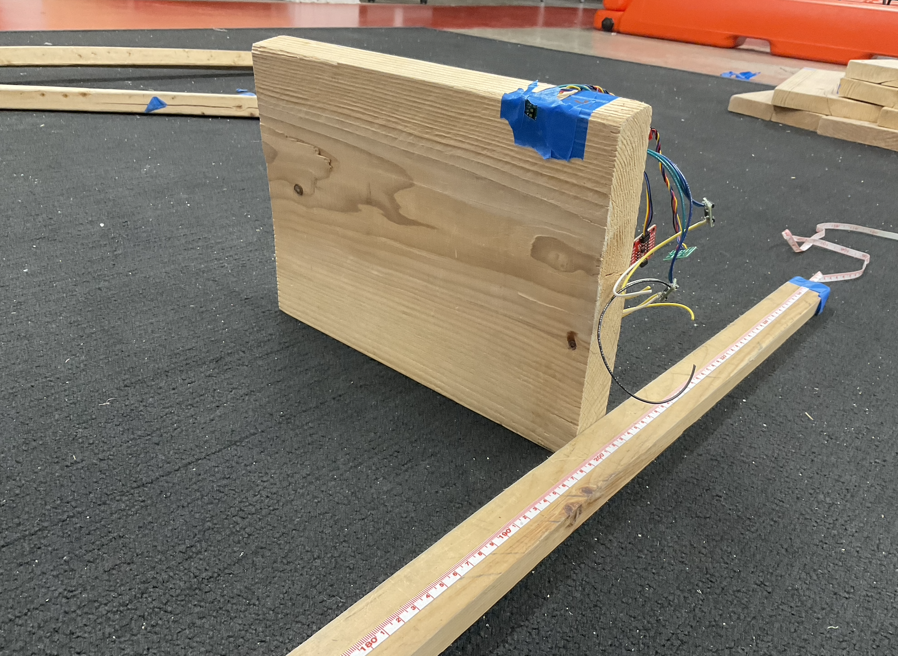
</div>

I set up a long tape measure and taped the ToF sensor on a wooden block. A GET_TOF_MEASUREMENT command sends the measured ToF value to the computer. 

#### Range test 

First, I tested the sensor range. According to the datasheet, the short mode has a range of 1.3m and the long mode has range of 4m. 

<div style="text-align: center;">
  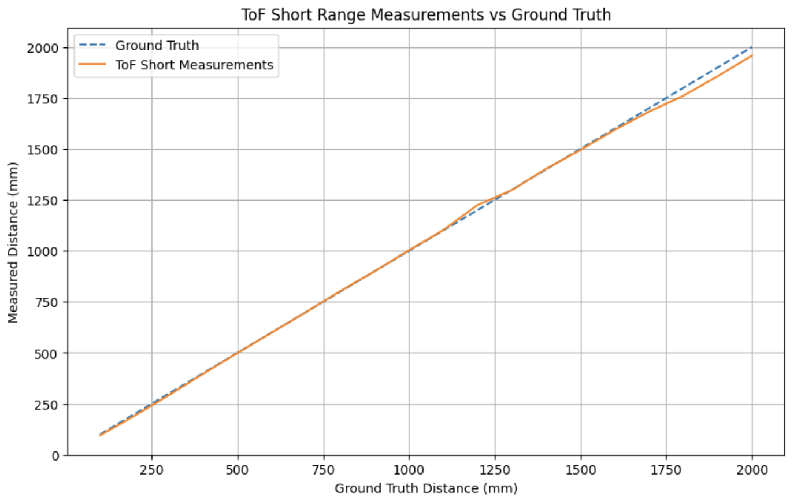
</div>

The short mode is able to measure distances reliably up to roughly 1.7m. 

<div style="text-align: center;">
  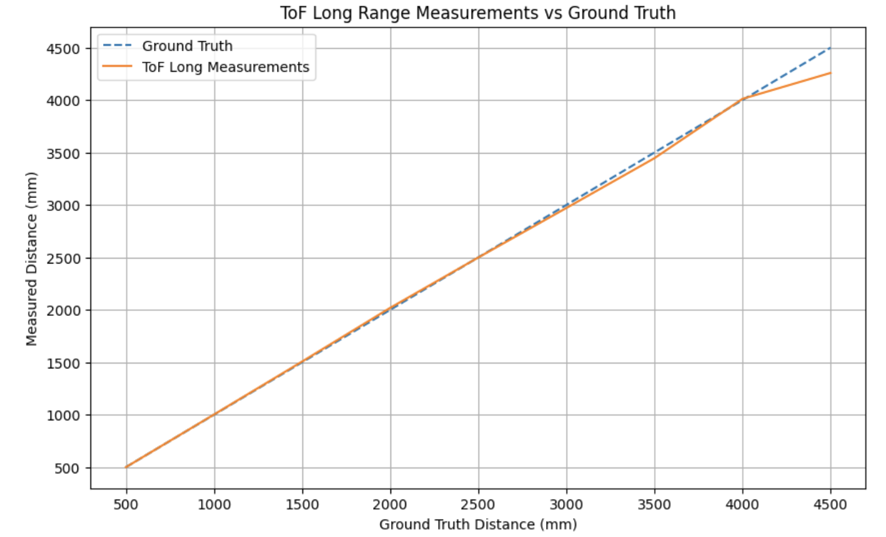
</div>

The long mode is able to measure up to 4 metres with accuracy, and falters at distances more than that. 

#### Accuracy test 

Measurements were captured every 10cm up to 2 meters, and plotted. 

<div style="text-align: center;">
  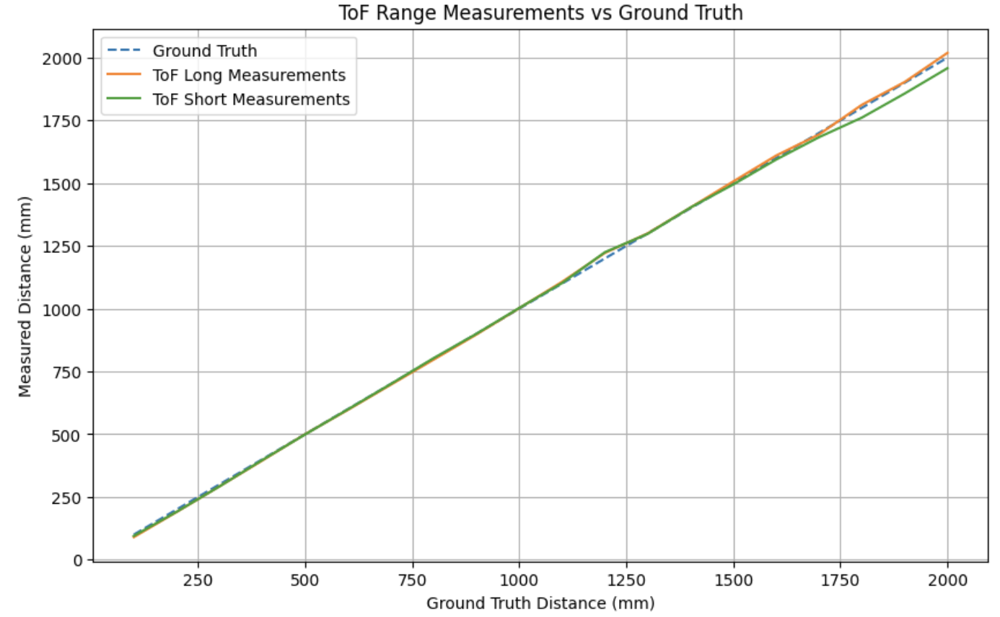
</div>

In general, both modes are able to measure distances accurately from the range of 10cm to 200cm, but the short mode errors a bit more for measurements more than 150cm. 

#### Repeatability test 

A total of 30 readings were captured from a distance 1m away from the wall. The errors are plotted as shown below. 

<div style="text-align: center;">
  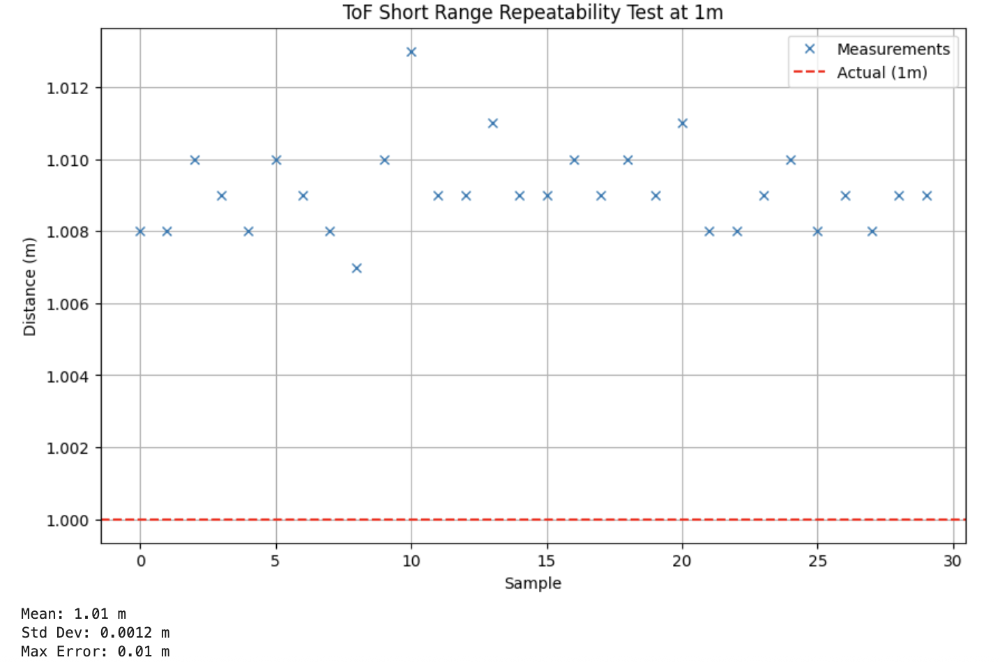
</div>

<div style="text-align: center;">
  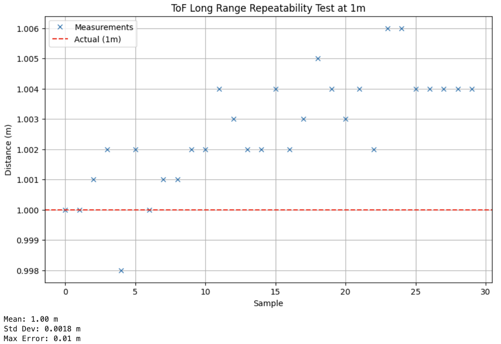
</div>

Both modes performed similarly on the repeatability test, with both modes returning the same maximum error of 10mm. Short range mode yields a mean of 1.010m with a standard deviation of 1.2mm, while long range mode produces a mean closer to the true value at 1.000m but with a slightly higher spread of 1.8mm. 

#### Ranging time 

30 distance measurements along with their timestamps were sent from Artemis to the computer. The average time taken for each measurement was calculated and shown below. 

| Mode       | Average Time per Reading (ms) |
|------------|-------------------------------|
| Short Mode | 48.2                          |
| Long Mode  | 94.7                          |

#### Choice of Sensor Mode

In general, both short and long range modes perform well for distances between 0 and 1.5 meters, which covers the expected operating range of the car. While long range mode extends measurement capability up to 4 meters, it comes at the cost of nearly double the sampling time. In order to implement closed-loop control of the car, high-frequency sensor updates are required. Therefore, I chose to use the short range mode. 

### Using both sensors 

To use both ToF sensors at the same time, we have to change the address of one of the sensors. Following [this](https://community.st.com/t5/imaging-sensors/can-we-change-the-vl53l1x-address/td-p/310169) forum discussion, we shutdown one ToF sensor, freeing the bus to communicate with the other sensor, change address, and bring up the second sensor. 

```C
#define SHUTDOWN_PIN 1

pinMode(SHUTDOWN_PIN, OUTPUT);
digitalWrite(SHUTDOWN_PIN, LOW);
distanceSensor2.setI2CAddress(0x30);
digitalWrite(SHUTDOWN_PIN, HIGH);
```
<div style="text-align: center;">
  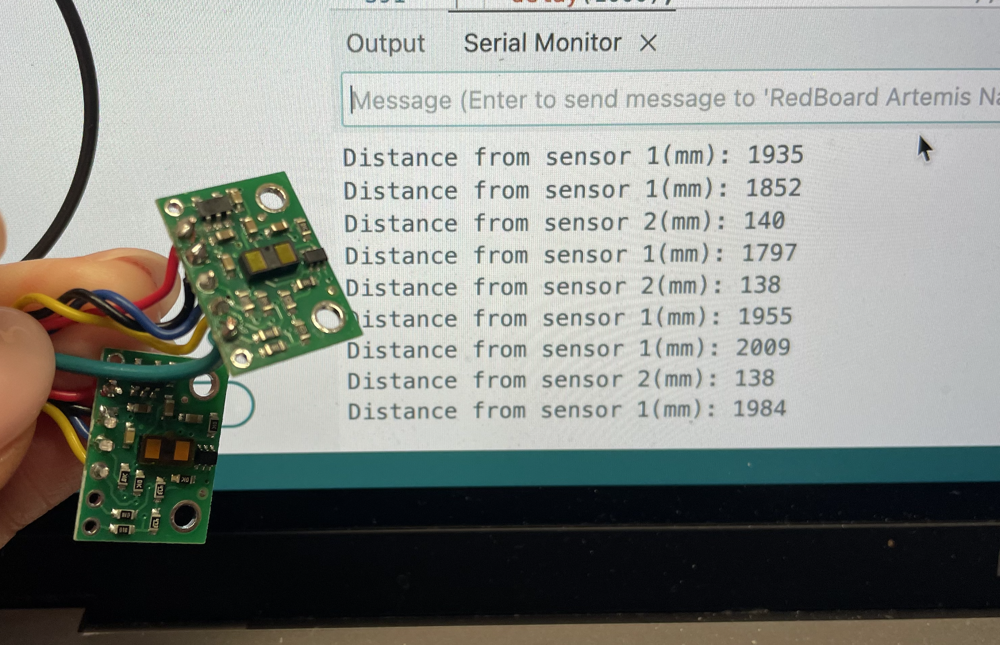
</div>

### Evaluation of Speed

In a while loop, the code checks if a distance reading is ready from both sensors, and prints the measurement if it is. Otherwise, it simply prints the time taken for the loop to run. 

<div style="text-align: center;">
  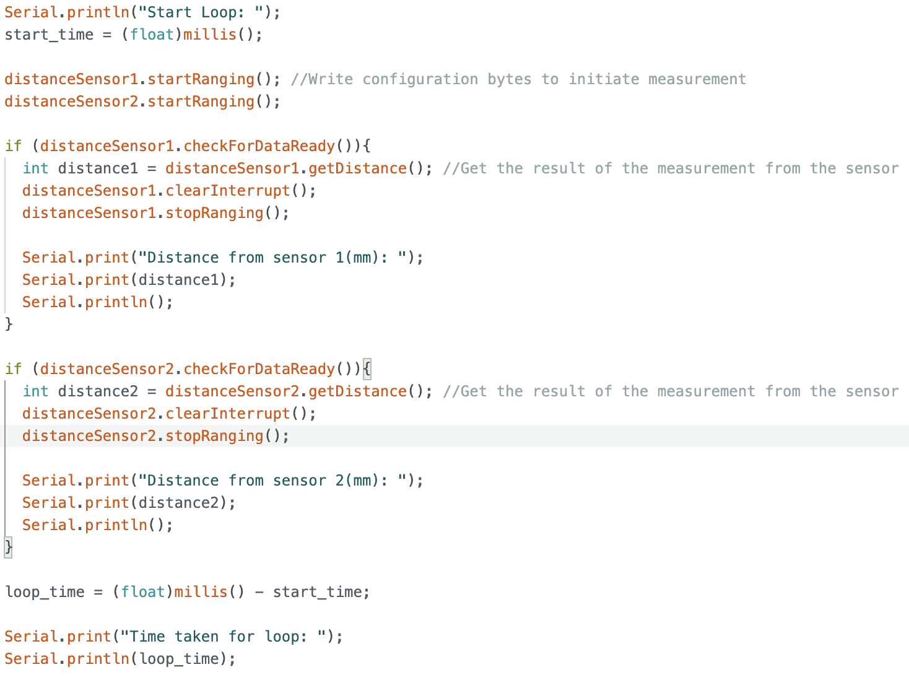
</div>

On average, the time taken for a loop to run without any measurements is 4.5ms. The time taken for a loop with measurements is 8.5ms. Extracting distance measurements adds about 4ms to the code execution time. 

<div style="text-align: center;">
  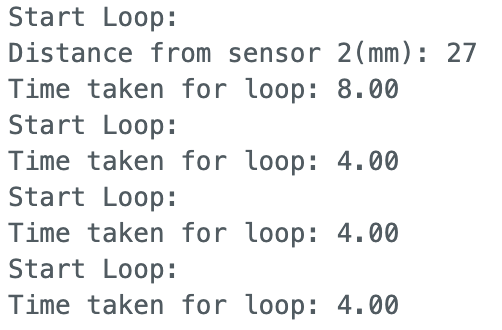
</div>

As such, the limiting factor is the ToF sensor reading frequency. We can reduce the time spent in reading distance data by calling startRanging() once before the loop, and removing stopRanging() from inside each loop. This shaves down loop time to ~2.5ms without measurements, and ~6.5ms with measurements, but the ToF sensor reading is still the limiting factor in the loop.

### ToF and IMU data 

The ToF sensor collects data at a much lower rate than the IMU. As such, I recorded 2 separate timestamp arrays, and let the data collection run for 1.5 seconds. 

<div style="text-align: center;">
  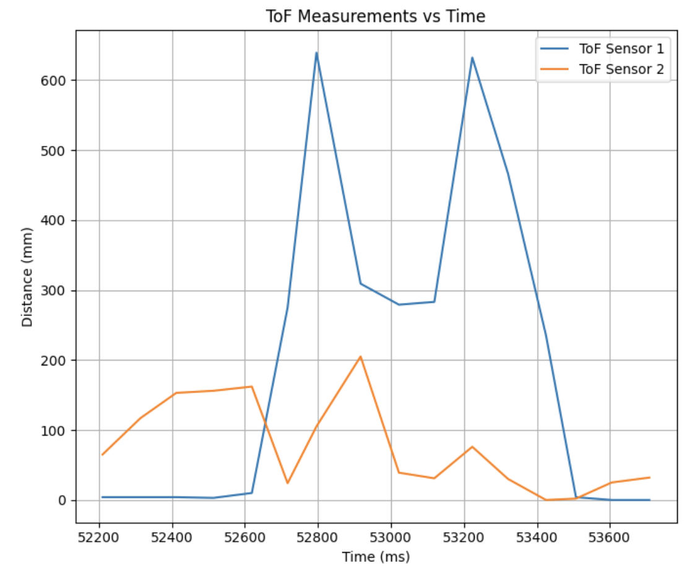
</div>

The ToF sensors took 16 measurements in 1.5 seconds, which averages about 10 measurements/second. 

<div style="text-align: center;">
  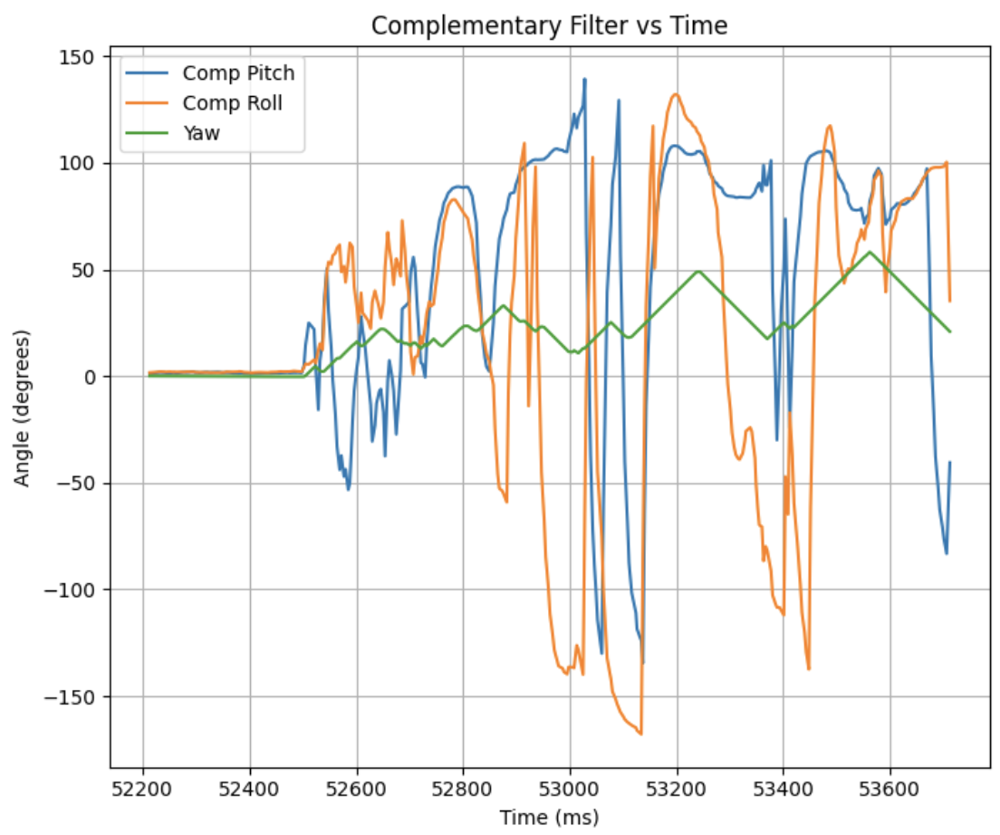
</div>

The IMU sensor took 365 measurements in 1.5 seconds, which is roughly 243 measurements/second. 

Plotting all measurements on the same graph, we obtain: 

<div style="text-align: center;">
  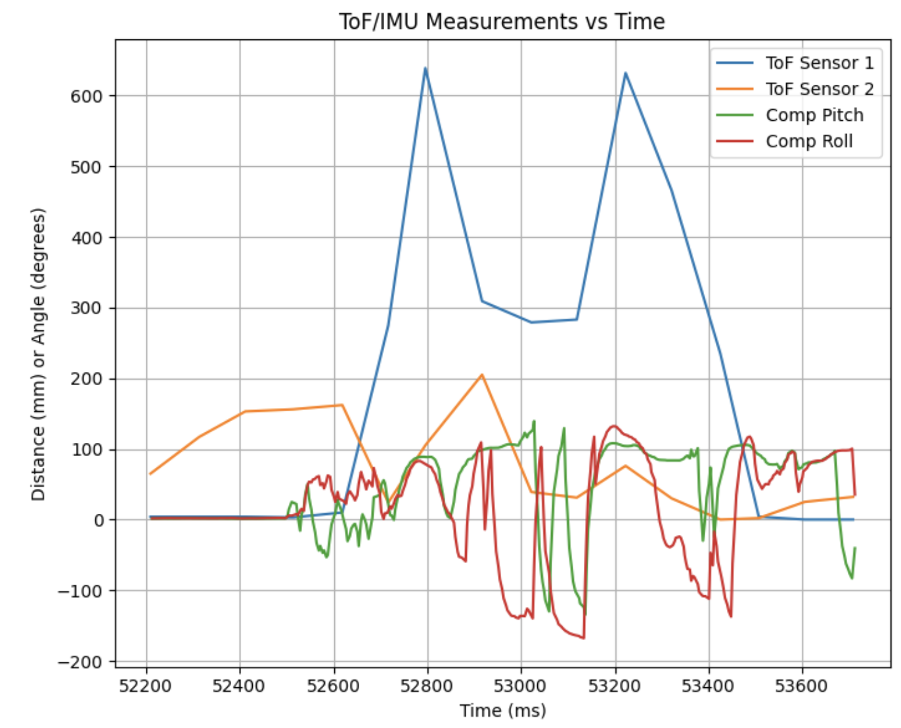
</div>

### Level 5000 Tasks:

#### Infrared Trasmission 
IR sensors are primarily categorized into active and passive types. Active sensors have both an emitter and receiver, transmitting an IR signal and detecting its reflection to infer distance. Passive sensors contain only a receiver, and detect motion in its surroundings by measuring changes in heat. 

The IR sensor, along with the commonly used LiDAR sensor, are active sensors. These are good for precise distance measurement, since they can emit IR signals in the direction of measurement. However, these sensors are sensitive to light,  which can saturate the receiver and degrade measurement accuracy. 

Passive sensors, by contrast, require no emitter and consume significantly less power. Since they rely solely on naturally emitted radiation, they are unaffected by active light interference. However, this also means that they are unable to provide precise distance measurements and are limited to detecting the presence or movement of heat-emitting objects.

#### Sensitivity to colors and textures

The ToF sensor was positioned one metre from the experimental surface

I tested the ToF on 3 different surface colors: white, blue and black. 

| Color | Measured Distance (m) |
|-------|-----------------------|
| White | 1.001                 |
| Blue  | 1.004                 |
| Black | 1.013                 |

White surfaces reflect IR strongly, producing the most accurate reading at 1.001m. Black surfaces absorb IR, reducing the return signal strength and introducing the largest error at 1.013m. Blue lies between the two, with a measured distance of 1.004m, consistent with its intermediate IR reflectivity.

Next, I tested the ToF performance on 4 different textures.

| Texture | Measured Distance (m) |
|-------|-------------------------|
| Wooden Plank  | 1.012           |
| Translucent Plastic   | 1.020   |
| Green Cloth   | 1.026   |
| Shiny Metallic | 1.009 |

Whilst surface color may have contributed to some variation, we can observe that more reflective and smoother surfaces give rise to more accurate readings. The shiny metallic surface gave a highly accurate reading, followed by the smooth wooden plank, plastic, and finally the green cloth. Specular surfaces return a stronger, more coherent IR pulse to the receiver, whereas rough surfaces scatter and attenuate the signal, introducing measurement error.

### References 
I referenced Aidan Derocher's page from S25, as well as John E KVAM's response in a STMicroelectronics forum to understand how to program the 2 ToF sensors with different addresses. 


