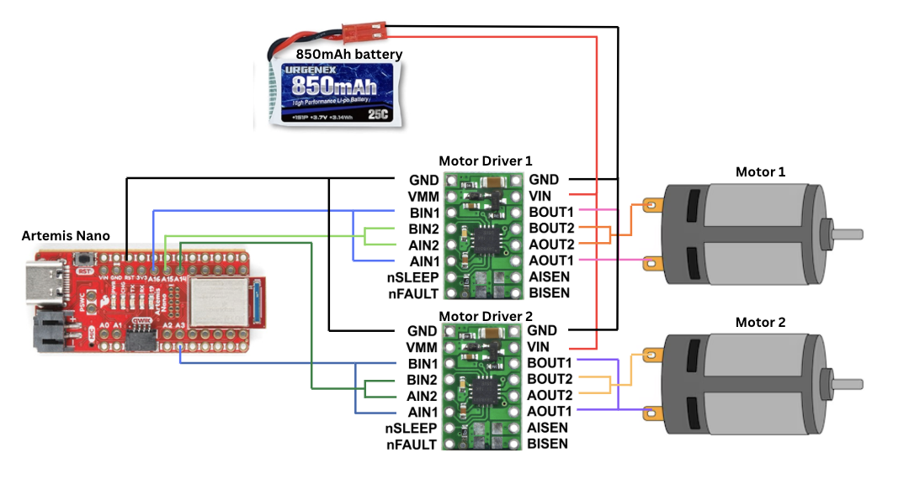
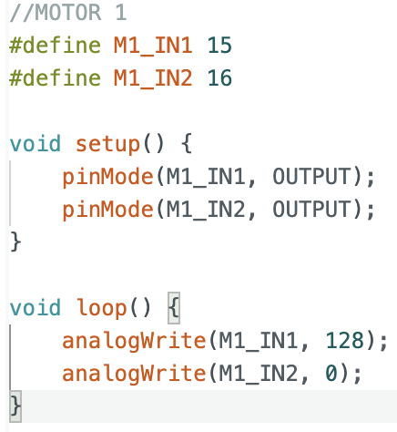
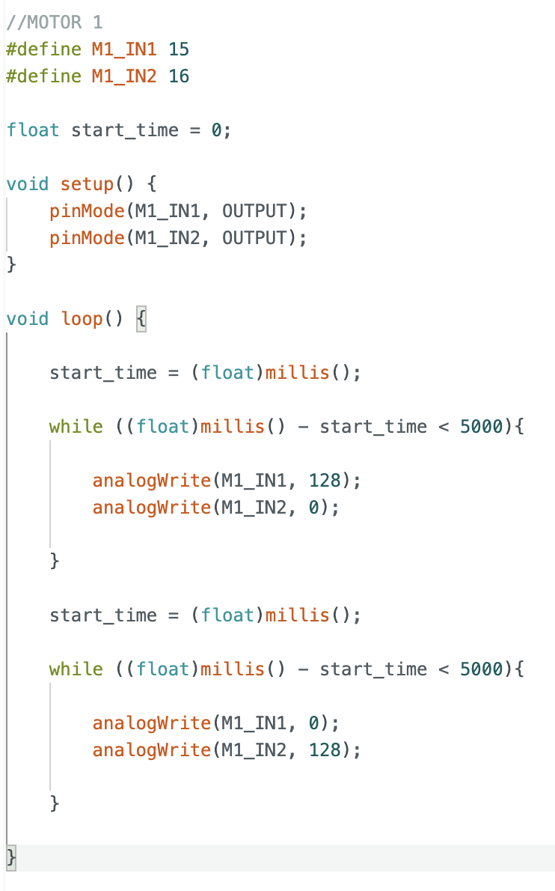
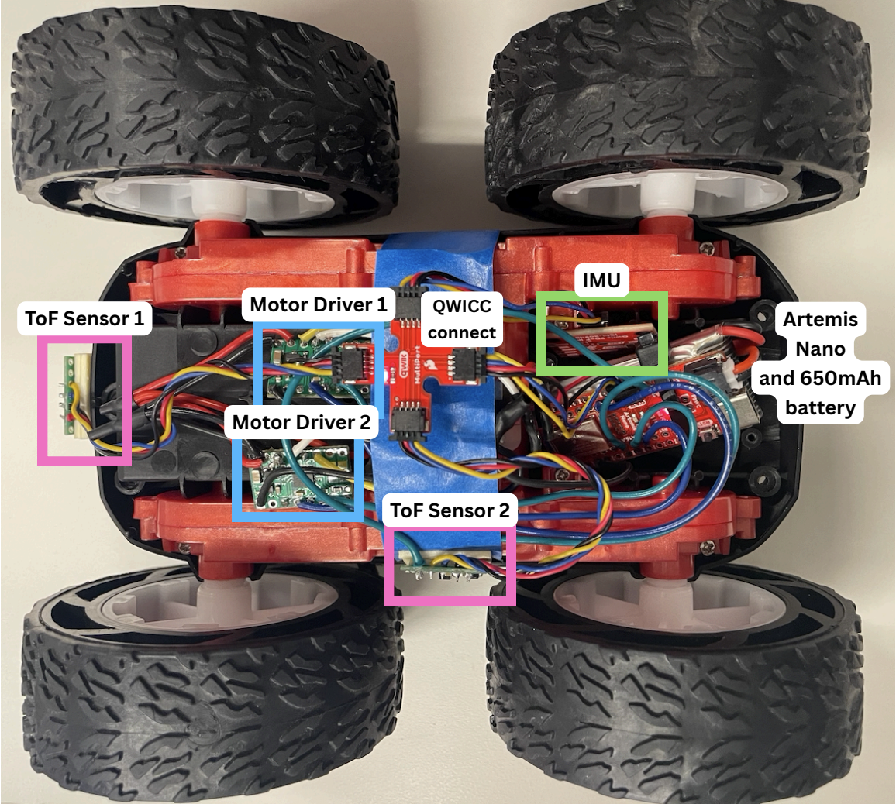
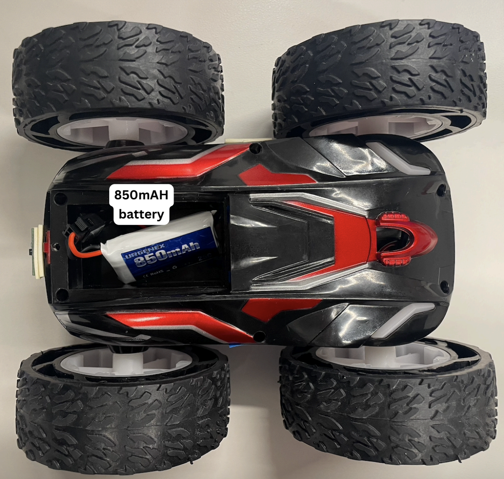
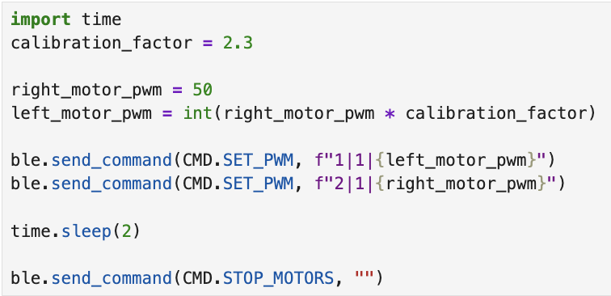
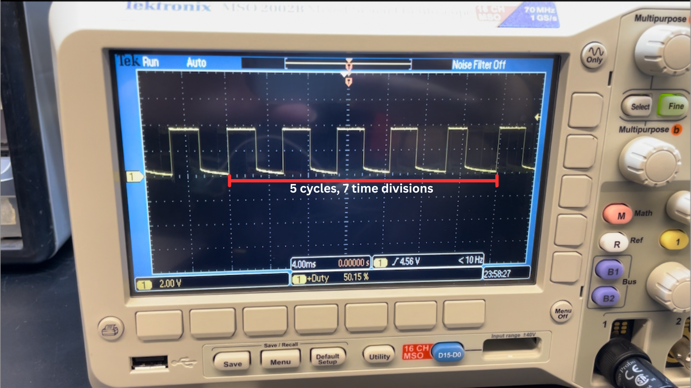
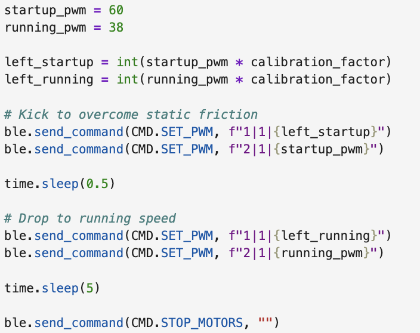

## Lab 4:

In this lab, we integrate two DRV8833 Dual Motor Drivers to control the wheels on our car. 

### Prelab: 

### Wiring Diagram: 

Each motor driver is capable of driving signals to two DC motors. To deliver twice the amount of current to each motor (1.2A * 2 = 2.4A), we parallel couple the inputs and outputs. The wiring diagram is shown below.

  

### Battery: 

We use a 650mAh battery to power the Artemis and a 850mAh battery for the motors. Motors draw large and rapid fluctuations in current, which can cause voltage drops on a shared power rail. If the voltage drops below the operating range of the Artemis, it could shut off in the middle of operation. Separating the two power lines would prevent this from happening. 

### Lab: 

### Motor Driver  

After soldering the IN and OUT pins of the motor driver, I tested its connections. The Vin and GND pins are connected to a power supply of 3.7V, with current of 2A. This is the same voltage supplied by the 850mAh battery, though according to the datasheet the motors have an operating voltage range from 2.7 V to 10.8 V.

Next, I uploaded the following script onto the Artemis. It sends a PWM signal with 50% duty cycle to the motor. 

  

The overall set up is shown in the video below: 

  <iframe width="560" height="315"
    src="https://www.youtube.com/embed/ChQQRzfp9Ao"
    title="Oscilloscope"
    frameborder="0"
    allowfullscreen>
  </iframe>

The square wave recorded shows a duty cycle of 50%. 

  

The H-bridge in the motor driver connects the motor to the supply voltage during the HIGH portion of the output square wave and disconnects it during the LOW portion. Increasing the duty cycle directly increases the average voltage and power delivered to the motor, causing them to spin faster. 

### Testing with external power supply 

Next, I soldered the OUT1 and OUT2 pins to the car motors. To test that the motor can spin in both directions, I programmed IN1 with a 50% duty cycle for 5 seconds, then switched this PWM signal to IN2. 

  

The wheel is able to spin in both directions. 

  <iframe width="560" height="315"
    src="https://www.youtube.com/embed/ySicu2it1UY"
    title="Single Wheel Spinning"
    frameborder="0"
    allowfullscreen>
  </iframe>

### Powering both motors with battery 

Next, I soldered both motor drivers such that they could be powered by the 850mAh battery. 

This video shows both motors rotating in both directions, powered by the battery:

  <iframe width="560" height="315"
    src="https://www.youtube.com/embed/txHWnoZXTBk"
    title="Stunt"
    frameborder="0"
    allowfullscreen>
  </iframe>

### Attaching Components 

Finally, I attached all components to the car, including the sensors, batteries, and QWICC connect. 

  

  

### PWM Limits

To find the lower limit in PWM value for which the robot moves, I first programmed both motors with a PWM of 10 and incremented the value until the motors started spinning when lifted in the air. 

| Motor      | Lower Limit PWM |
|------------|-----------------|
| Left       | 70              |
| Right      | 50              |

Next, I tried to find the lower limit for when the robot turns on axis. 

| Motor      | Lower Limit PWM |
|------------|-----------------|
| Left       | 160             |
| Right      | 140             |

  <iframe width="560" height="315"
    src="https://www.youtube.com/embed/PYZbEwfmXWQ"
    title="Stunt"
    frameborder="0"
    allowfullscreen>
  </iframe>

The PWM values are higher than driving in a straight line, as the motors need to overcome more initial friction when turning on axis. 

### Calibrating the motors 

For the same PWM value, my right motor spins faster than the left. As such, I calibrated the two motors using this script:

  

I obtained a calibration factor of 2.3. A video of the car moving in a straight line is shown below:

  <iframe width="560" height="315"
    src="https://www.youtube.com/embed/hPMHl9oVOG4"
    title="Stunt"
    frameborder="0"
    allowfullscreen>
  </iframe>

### Level 5000 Tasks:

#### AnalogWrite() frequency 
We can calculate the default frequency of analogWrite() using the oscilloscope.   

  

5 cycles of the square wave across 7 time divisions gives a frequency of ~178Hz, which is on the lower end. (Note: A more accurate frequency could be obtained from the oscilloscope measurement function, but I already soldered the motor driver outputs before this part so I could not rerun this experiment.)

A lower PWM frequency allows the motor coils to extract more energy per pulse, as the magnetic field has more time to build up within each cycle. This reduces the minimum duty cycle required for the motor to overcome static friction and begin spinning. We observe this behaviour in our previous experiments where a PWM in the range of 50-70 is able to allow the car to move forward. As such, this frequency seems to be adequate for our robot. 

We can manually configure our Artemis to generate a higher PWM frequency, and this would give a smoother average current supplied to the motors. A benefit of doing so would be less motor jitter and more precise control at high speeds. However, a higher PWM frequency would also mean more heat dissipated during operation. This would be a problem as even driving the robot at low PWM frequency causes the driver motor to overheat and disable itself at high duty cycles. 

#### Lowest PWM value speed 

To find the lowest PWM value required, I ran this script:

  

I tuned `running_pwm` until the motors could just continue coasting, and obtained a value of 38. 

  <iframe width="560" height="315"
    src="https://www.youtube.com/embed/6CKLXg8hucE"
    title="Coasting"
    frameborder="0"
    allowfullscreen>
  </iframe>

### References 

I referenced this [article](https://learn.adafruit.com/improve-low-speed-performance-of-brushed-dc-motors/pwm-frequency) by Adafruit in understanding how PWM frequency affects motor performance. 
