## Lab 5:

### Prelab:

To control the PWM signals on my car, I wrote 4 different commands: 

1. SET_GAINS: Sets the Kp/Ki/Kd value, as well as the goal distance. 

  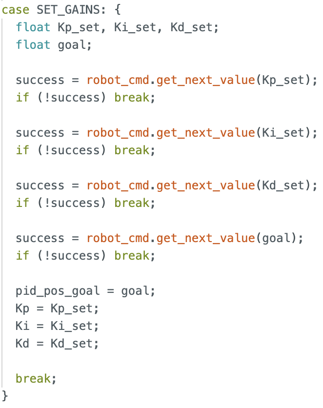

2. START_PID_AND_RECORD: this command starts the controller, and starts recording ToF sensor data, and motor outputs. 

  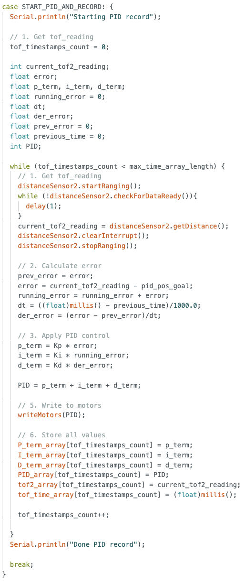

3. STOP_PID_AND_SEND_DATA: this command stops the motors, and sends all data recorded in the previous START_PID_AND_RECORD command back to the Jupyter notebook.  

4. STOP_MOTORS: hard stop of the car.

  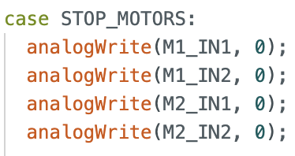

In the case where the bluetooth disconnects, the Artemis is programmed to stop the motors.  

### Lab:

There are a few considerations for designing the PID controller: 

#### Deadband and Calibration Factor

| Motor      | Lower Limit PWM |
|------------|-----------------|
| Left       | 70              |
| Right      | 50              |

The lower limit of the PWM values are 70 and 50. As such,all non-zero PID outputs need to be scaled to [PWM_MIN, 255]. Here, we choose PWM_MIN to match the left motor limit, and afterwards apply the calibration factor of 2.3 to find the left PWM input. 

  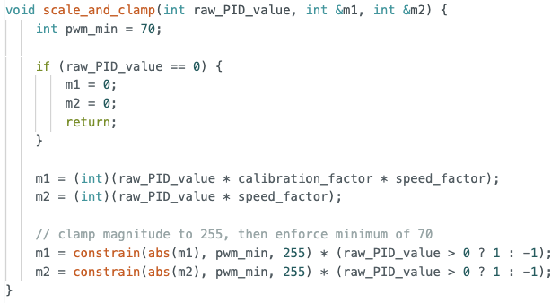

Depending on the sign of the PID control value, we determine if the motors should move forwards (positive) or reverse (negative).

  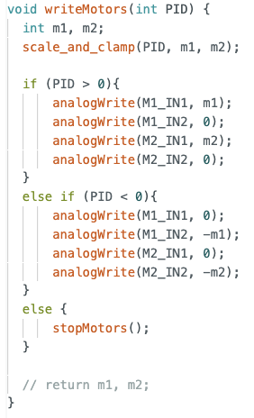

### Tuning PID values 
Given $PID = K_p (x-x_{goal})$, and the range of our ToF sensor is 1300mm (short range), Kp has a maximum value of 0.196. 

I first started with only P control, Kp = 0.15. 

  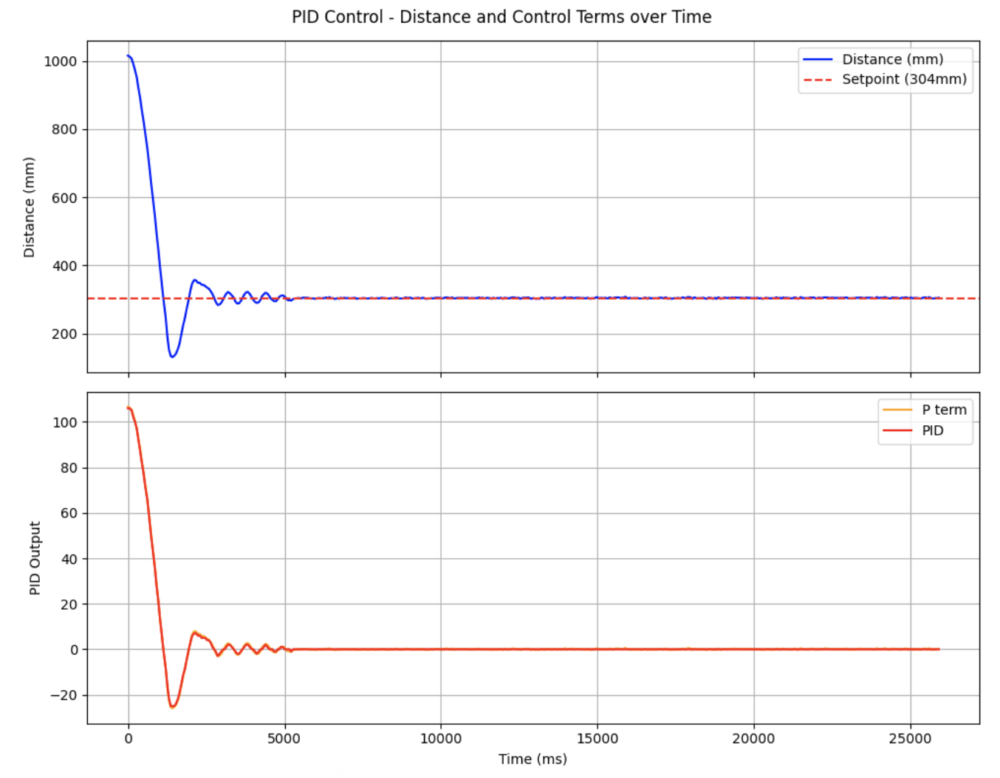

From the graph, we see that the car moves quickly to the set point, but there is considerable overshoot and oscillation. Therefore I decided to incorporate a D term, to remove oscillations. 

I started with a value of 0.05 and slowly decremented it until 0.02, where I saw less overshoot and minimal oscillations.

  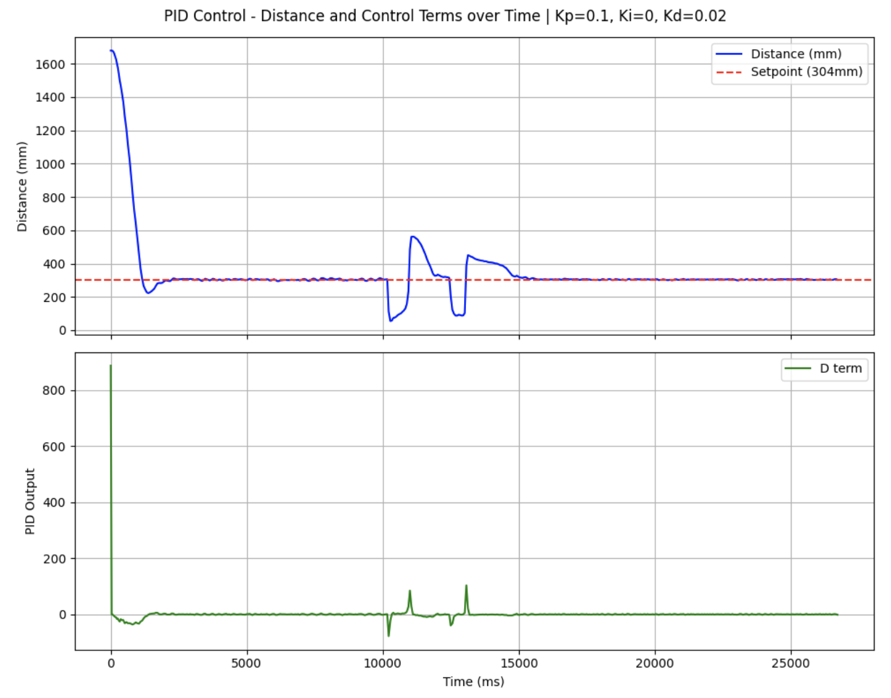

The two latter peaks are from when I kicked the car, and the car moved back to place quickly. 

Whilst I did not observe a steady state error, I decided to add a Ki term in situations where the car is moving on rougher (higher friction/inertia) surfaces, and Kp/Kd terms are insufficient to move the car to the set point. 

  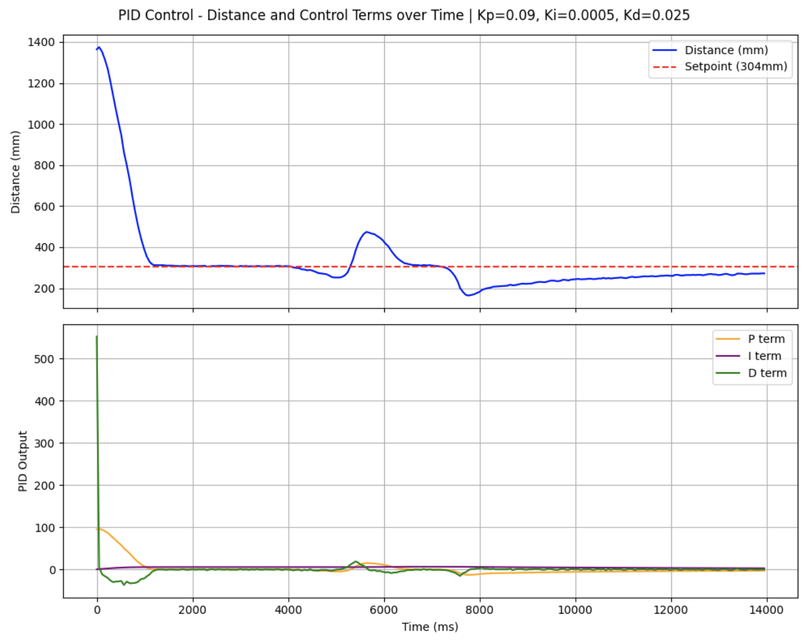

The car moves quickly towards the setpoint and settles within ~2 seconds with minimal overshoot. It moves back to the setpoint quickly despite perturbances, due to the new I-term. 

  <iframe width="560" height="315"
    src="https://www.youtube.com/embed/VCH-C5sTuEI"
    title="Stunt"
    frameborder="0"
    allowfullscreen>
  </iframe>

The final values obtained are: 

| Parameter | Value   |
|-----------|---------|
| Kp        | 0.09    |
| Ki        | 0.00005 |
| Kd        | 0.025   |

### Linear Extrapolation 
The ToF samples at roughly 18 samples/second, and the current PID control loop runs at the same rate. 

To decouple the two, I used the two most recent readings are used to linearly extrapolate an estimated current distance.

  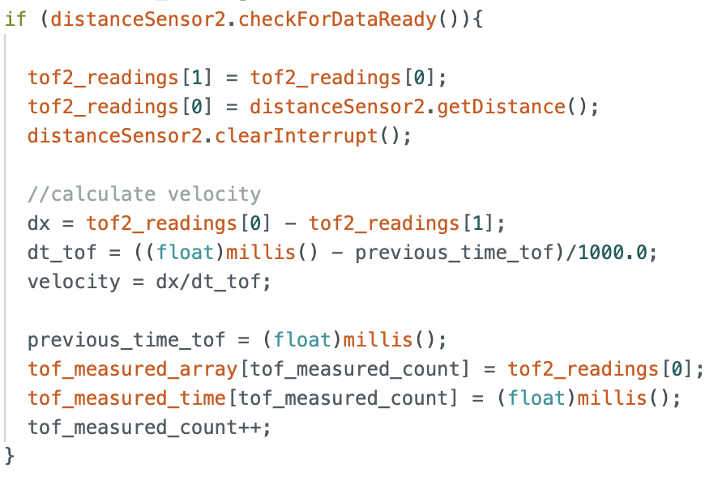

I ran into an issue where the car would not move, and the D-term was 0. It only worked after I added Serial.print lines, which signalled a timing issue. It turned out that the control loop was running so fast that millis() was too coarse, and dt was returning 0 (undefined divide). As such, I used micros() for the control loop.

  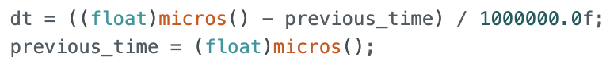

Similarly, the d-term spikes because the control loop runs so fast that dt is very small, so every new tof readings causes large jumps.

  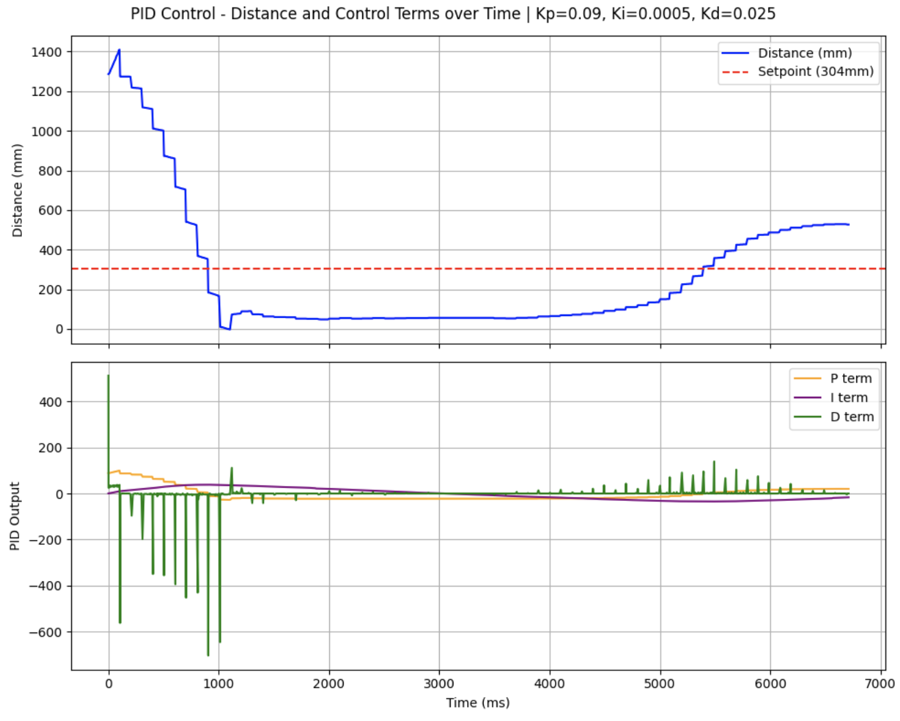

As such, I added a LPF for der_error. 

  

With the above, the control loop runs 146 times per second. 

  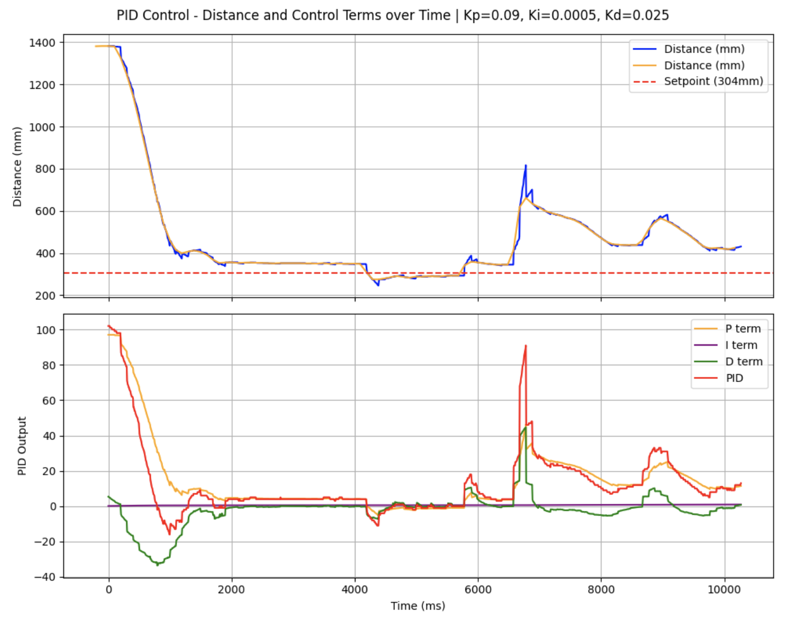

### Analysis of System 

#### Repeatability and Accuracy

This video demonstrates 3 successful runs with the car, from 304mm to 250mm to 200mm. 

  <iframe width="560" height="315"
    src="https://www.youtube.com/embed/KmcOlPwVdy4"
    title="Stunt"
    frameborder="0"
    allowfullscreen>
  </iframe>

The plots are shown below, the car moves very close to the set point. 

  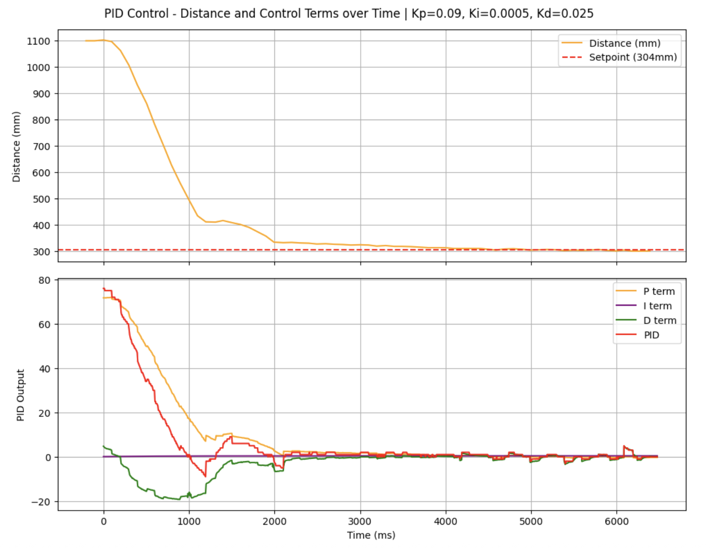
  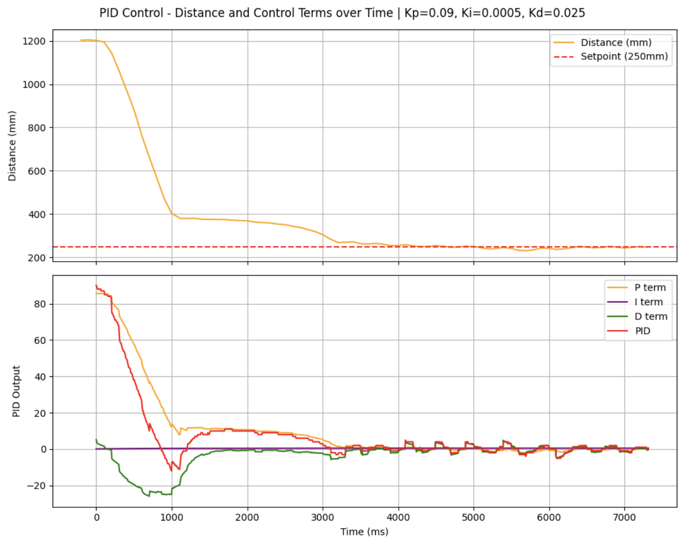
  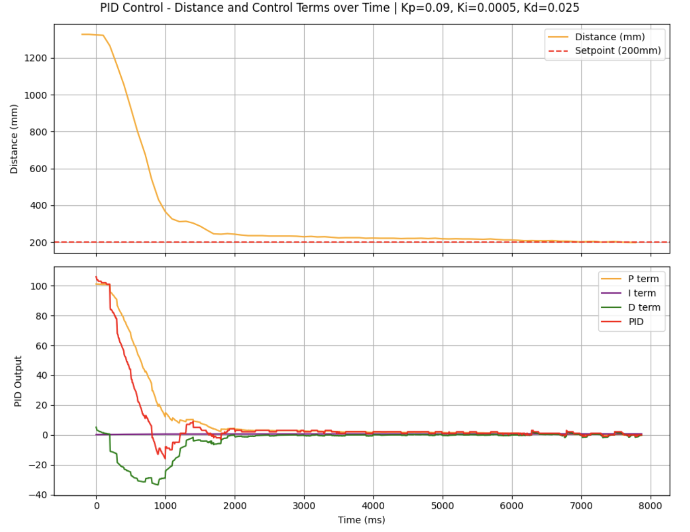

#### Maximum Speed 

Plotting a speed graph: 

  

The maximum linear speed achieved by my car is ~2m/s, at the beginning where the car is furthest away from the set point. 

### Level 5000 task: Integrator Windup 

When the car starts far from the wall, the I-term accumulates a large error over the long approach.

  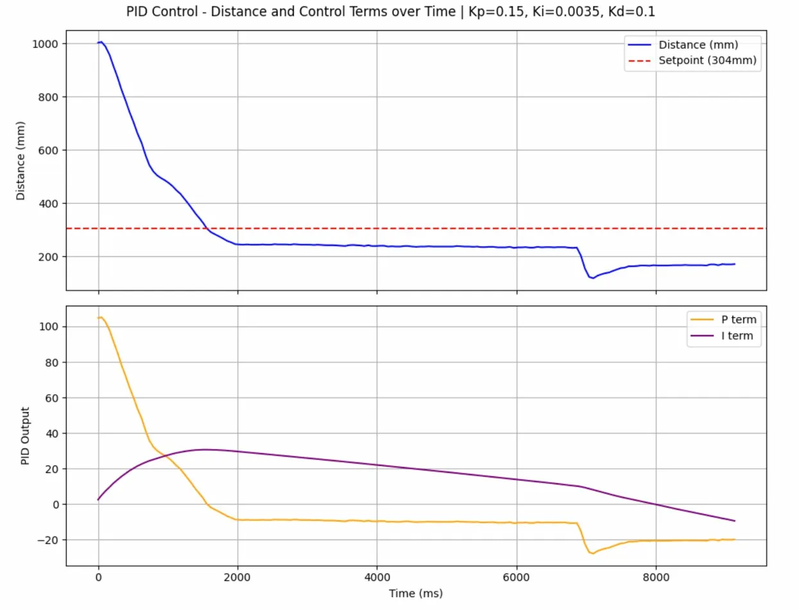

From the plot above, even when the error is negative and the car should be moving away from the wall, the i-term remains positive due to integrator windup and drives the car further into the wall.

To mitigate this, I added a wind-up protection to my code. 

  

I increased Ki to better observe its effects. The i-term plateaus past a maximum point. 

  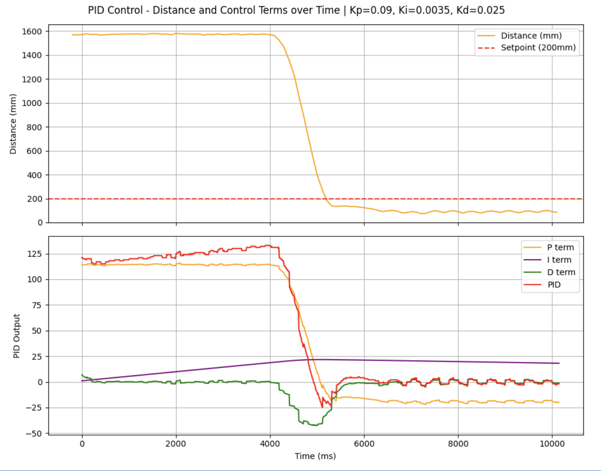

Now, even if I hold the car still at the beginning and allow error to accumulate, the car does not zoom straight into the wall when I release it.

  <iframe width="560" height="315"
    src="https://www.youtube.com/embed/n2cnD8AGALo"
    title="Stunt"
    frameborder="0"
    allowfullscreen>
  </iframe>

### References
I referenced Stephan Wagner's Lab 5 report to implement the D-term for PID control. 

