## Lab 6:

### Prelab:

### IMU discussion 

#### Digital Integration and Gyroscope Bias

In Lab 2, we use the gyroscope to get anglular velocity readings, obtained through digital integration: 

  

However, this method suffers from substantial drift due to accumulation of small errors during integration. These errors are due to inherent bias of the gyroscope (~1° drift/second for yaw), which blow up over time. 

One solution we tried was to use a complementary filter with the accelerometer values, but the accelerometer does not provide yaw readings, which we want for this lab. 

#### Digital Motion Processor
As such, I decided to use the digital motion processor (DMP). It fuses readings from the gyroscope, accelerometer and magnetometer to obtain a more accurate yaw reading. 

I followed Stephan Wagner's DMP tutorial for this part. Critically, the DMP writes readings to a buffer, and readings must be pulled out of the FIFO queue faster than it fills, otherwise the Artemis crashes. 

There are 2 ways to ensure that the FIFO queue remains empty: 
1. Every time we read from the FIFO, we also clear the FIFO. I included the following code snippet in both the void loop() as well as the PID control loop. 

  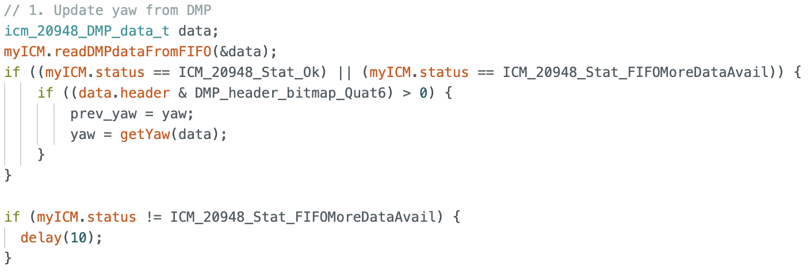

2. Lower the output data rate(ODR). My control loop from Lab 5 ran at around 100Hz, which is much faster than the default 55Hz ODR. Therefore, I decided not to lower it. 

  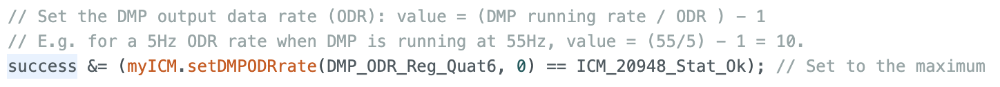

#### Gyroscope Range
The maximum rotational velocity of the gyroscope is +-2000 degrees per second. This is sufficient for our car, because even a full flip under gravity would not exceed this limit. We can program the range by changing the value of the GYRO_FS_SEL register:

  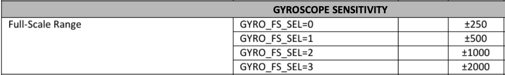
  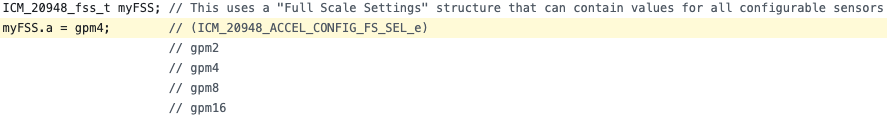

### Lab: 

### Code Setup 
Similar to lab 5, I implemented a command START_PID_YAW_AND_RECORD, which starts the control loop. 

  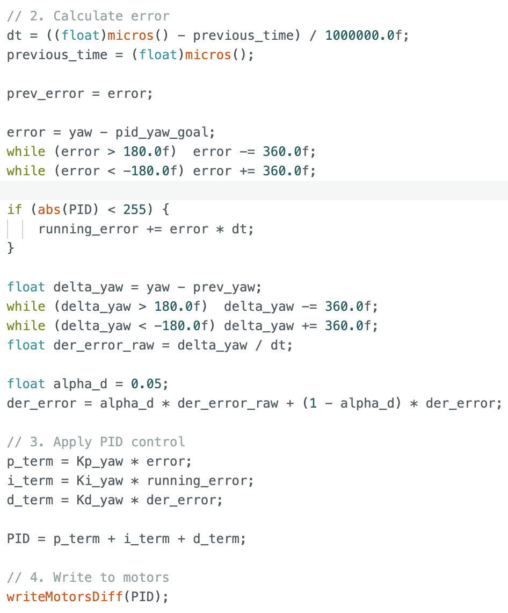

The writeMotors command is updated for differential drive:

  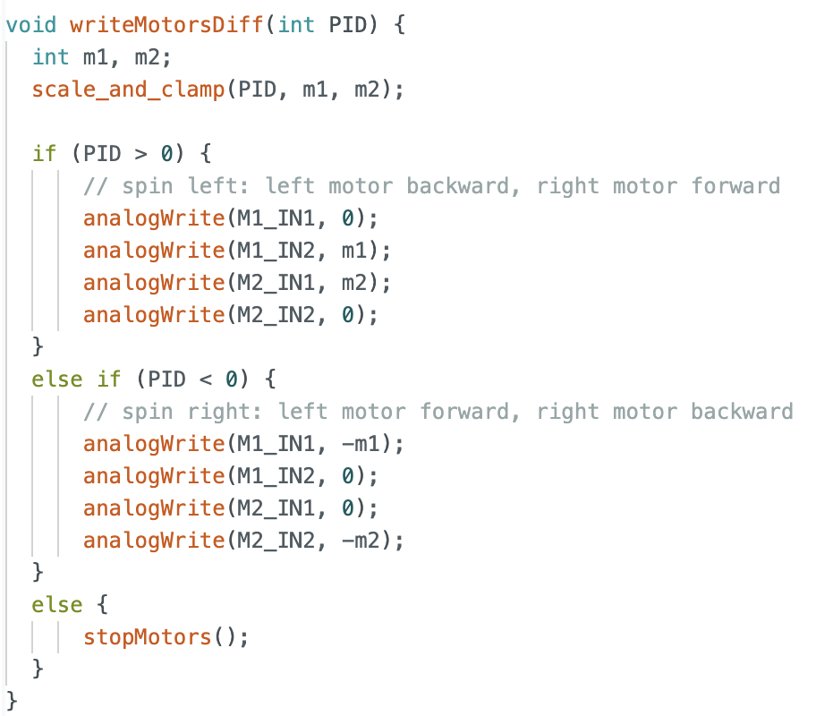

With the above implemented, we can move onto PID tuning. 

### PID tuning 
#### P-term
The gyroscope has a range of -180 to +180. With clamping, the maximum error is 180. Therefore a reasonable starting point for Kp is 1.4. 

When I first started tuning Kp, I realised that the car would spin rapidly, especially around the boundaries 180/-180 and 0/-0. This caused the error to jump to 360. 

  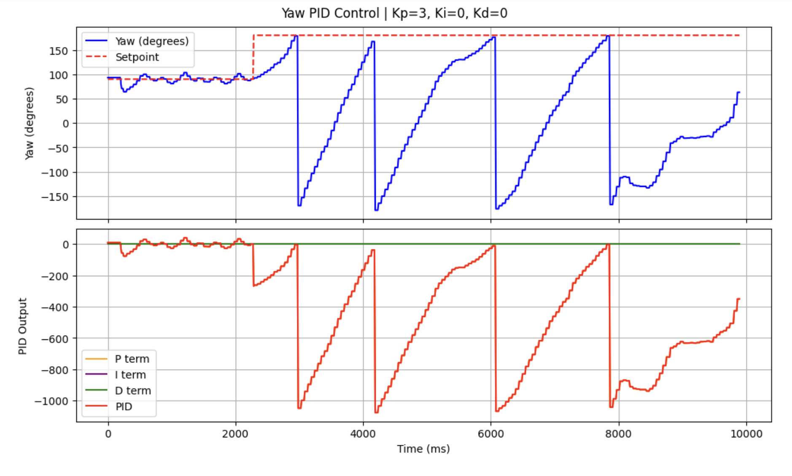

As such, I introduced a wrap-around for error:

  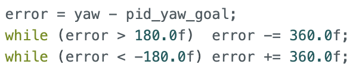

Another issue I noticed with setting Kp to be near 1 is that for small errors, the PWM value is too small to overcome friction and allow the car to rotate. Therefore, I increased Kp to 3.

  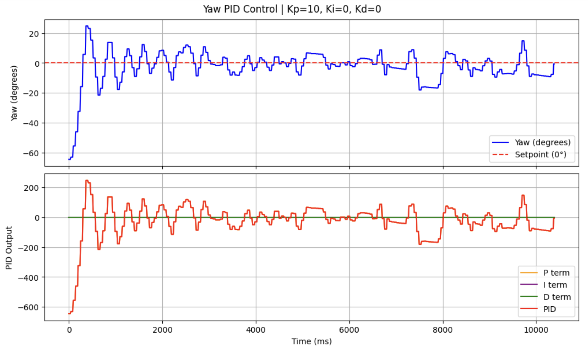

#### D-term

To reduce oscillations, I introduced Kd. Similar to wrapping the error values, I also added a check for delta_error:

  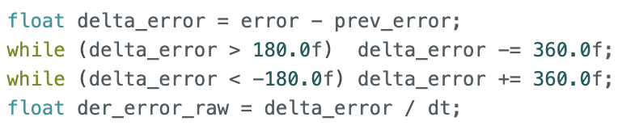

##### Taking Derivatives 

Typically, the gyroscope returns yaw acceleration values, which we integrate to get a yaw reading. In such cases, taking the derivative of a integral to calculate derror/dt would be unncessary. In our case, we use DMP which returns an angle instead of angular acceleration, so we can calculate the derivative. 

##### Low Pass Filter 

The D-term is sensitive to any changes in angle, even noise from the DMP readings. As such, the car oscillates in place once it has reached its set point, even though the d-term is supposed to reduce oscillations. 

  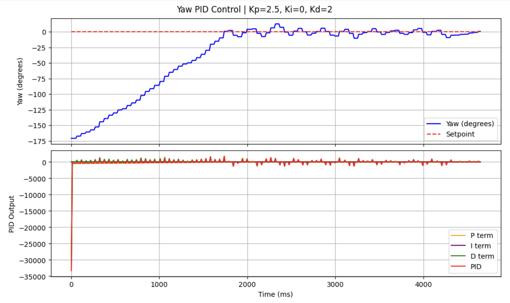

As such, similar to lab 5, we write a LP filter for the d-term.

  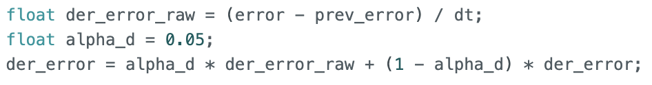

This results in less jitter around the set point.

  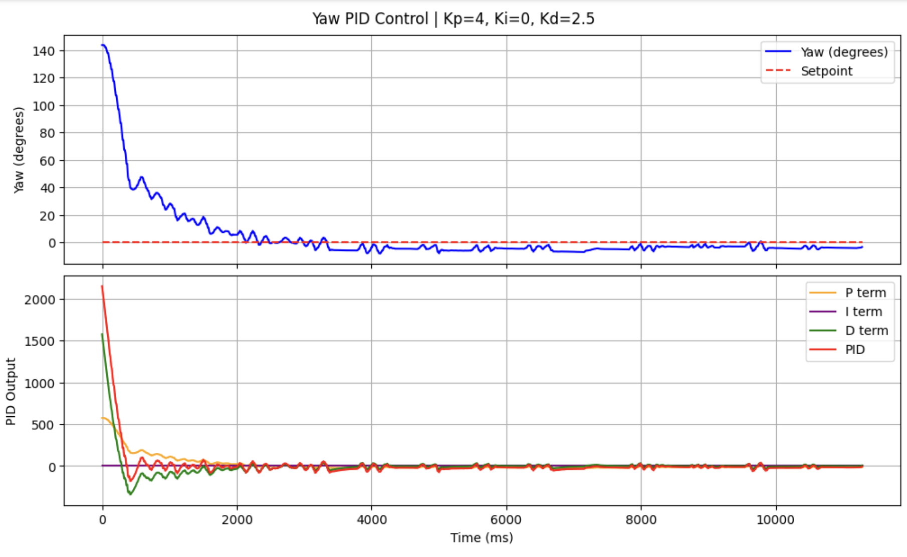

##### Derivative Kick 

Next, I set 3 consecutive setpoints: 0, 90, 180. 

  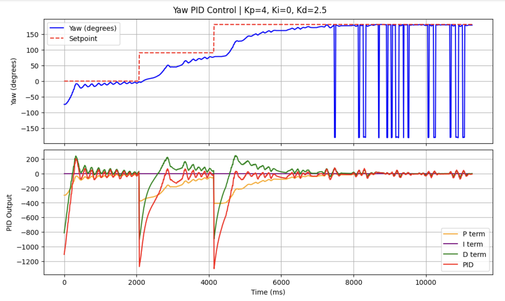

The d-term spikes when the setpoint is changes, because the error becomes very large and so does its derivative. 

To circumvent the derivative kick, I differentiate the measured yaw directly instead of the error.

  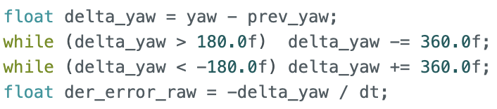

As such, the derivative term no longer peaks at setpoint changes. 

  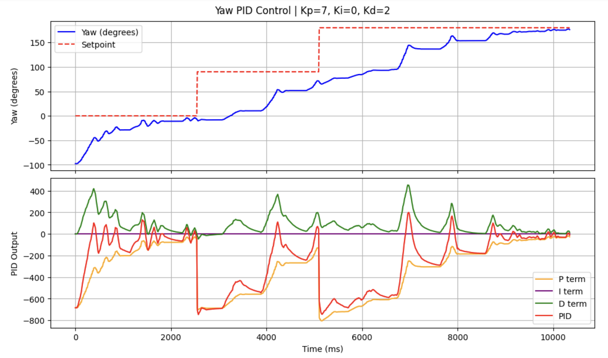

#### I-term

Lastly, I introduced Ki. First, I wanted to encourage the system to react faster to changes in setpoint, which the additional i-term would contribute to. More importantly, I wanted to minimize any steady-state errors. 

  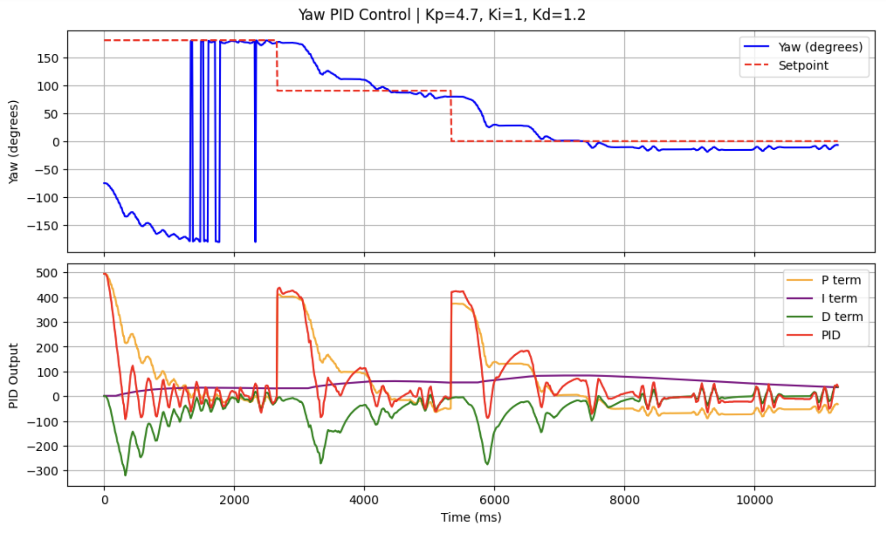

We first observe the large changes in yaw when the setpoint is 180 degrees: at this boundary, the sign flips. Nonetheless, our P, I and D terms all stay low because our error is wrapped to [-180, 180], ensuring the controller always takes the shortest angular path and sees only a small error at the boundary.

Next, we observe that the controller reacts rapidly to the changes in set point and can reach the new setpoint in roughly 2.5 seconds. There is also limited overshoot, due to the derivative kick protection code we implemented. 

As such, I concluded PID tuning with these values:

| Parameter | Value   |
|-----------|---------|
| Kp        | 4.7     |
| Ki        | 1       |
| Kd        | 1.2     |

  <iframe width="560" height="315"
    src="https://www.youtube.com/embed/x0GoT5FKvOs"
    title="Stunt"
    frameborder="0"
    allowfullscreen>
  </iframe>

### Programming Implementation 

It is necessary to stop the motors, or change the set points/ PID gain values in the middle of a control loop. To achieve this, I check for BLE connection on every loop in my command:

  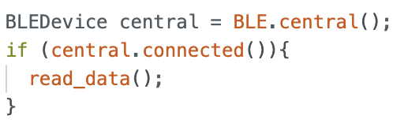

This allows any commands sent in the middle of this PID control loop to be executed as well. 

To stop the motors, I created a command STOP_MOTORS that turns the stopMotors_flag on. The PID control loop checks if the flag is true, which then stops the motors and breaks out of the command.

  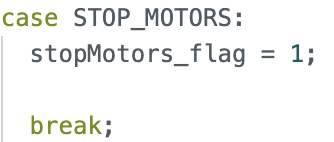

  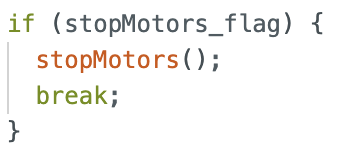

PID control can be restarted by running the START_YAW_PID_AND_RECORD command. 

#### Controlling direction and orientation at the same time 
We can calculate the linear PID and orientation PID in the same control loop, and then apply differential drive mixing for the robot to change its linear and angular speed. 

For example, the linear PID might give a PID value to move forward, and the orientation PID might give a command to turn right. Then, the command written to the motors would be:

left: speed_PID + orientation_PID
right: speed_PID - orientation_PID

The left wheels will spin faster and the robot moves forward whilst turning right. To make this implementation easier, we can move the PID calculations to a function that we call from the command. 

### Sampling Time 

The control loop runs independently of the DMP as yaw values are only updated when new data is ready in the FIFO. 

The control loop runs at roughly 100Hz. The sampling rate of the DMP is around 57Hz. As such, I did not need to lower the output sampling rate of the DMP. 

### Level 5000: Integrator windup 

Integrator windup can cause large overshoots, as shown in the video below. 

  <iframe width="560" height="315"
    src="https://www.youtube.com/embed/PFRK9qDWmhs"
    title="Stunt"
    frameborder="0"
    allowfullscreen>
  </iframe>

  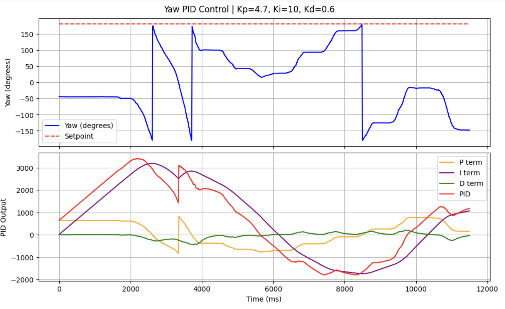

We observe the i-term increasing as the error accumulates, causing the car to spin past its set point and converging a long time later. 

Hence, similar to lab 5, we add an integrator windup protection. 

  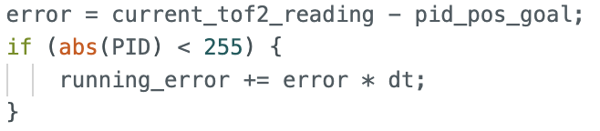

  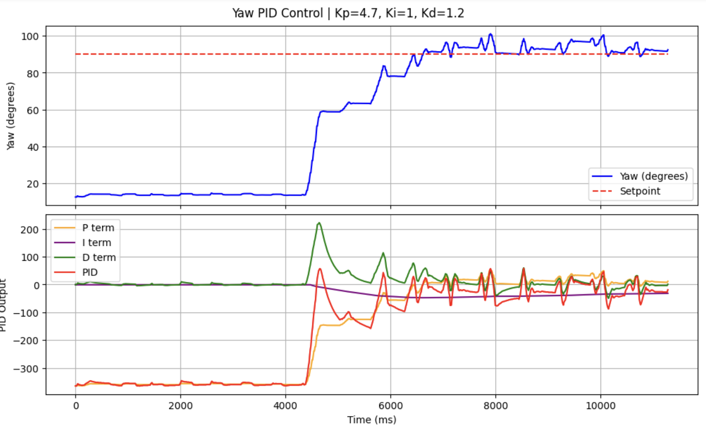

Although the car was held in place at the start, the error does not accumulate as the p-term has already caused the PID control to be maximised. Therefore, there is no overshoot after the car is released. 

### References: 

I referenced Stephan Wagner's DMP tutorial to set up DMP for this lab. 

