

### Lab Tasks
### Estimating drag and momentum 

The state space equation of our system can be represented as followed:

  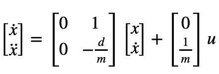

To find matrix A and B, we need to estimate drag, d and mass, m. 

To reach steady state, the car needs to start up and run for an extended period of time. To achieve this, I set the ToF to long mode so it can read up to 4m. 

The motors are programmed with PWM 130 (u = 130/255) and added a hard stop when the car was 0.3 metres away from the wall. 

However, I faced 2 issues: 
1. 4m is not enough distance for the robot to reach steady state as it is still accelerating when it hits the wall. To give the robot more distance to settle into steady state, I start the robot ~5m away from the wall. 

2. However, the ToF values returned are unreliable when the car is more than 4m away from the wall. Erraneous values cause the car's hard stop to kick in, and the robot stops. 

To circumvent these issues, I programmed the robot run for 0.3 seconds without measurements, and only start ToF measurements once the car is <4m away from the wall.  

  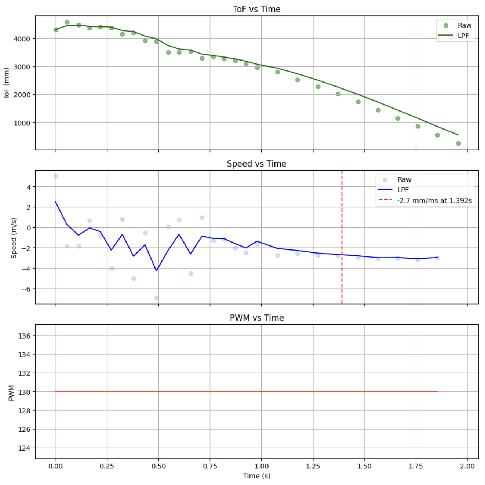

I added a LPF on the ToF readings because the initial readings when the car is moving slower has more variance. I also measure 90% rise time after 1 second, where the readings are more reliable. 

| Parameter | Value   |
|-----------|---------|
| Steady State Speed   | 3.0 m/s     |
| 90% Rise Time        | 1.692s (+0.3 for start up time)       |
| Speed @ 90% Rise Time       | 2.7 m/s     |

$$d = \frac{u}{\dot{x}_{ss}}$$

$$m = \frac{-d\cdot{t_{90}}}{\ln(0.1)}$$

| Parameter (in S.I units) | Value   |
|-----------|---------|
| drag d       | 0.170    |
| mass m       | 0.125    |
| sampling time dt       | 0.067    |

### Initialize KF in Python 

#### A and B matrix and discretization 

I found A and B matrices to be: 
$$A = \begin{bmatrix} 0 & 1 \\ 0 & -1.36 \end{bmatrix}, \quad B_d = \begin{bmatrix} 0 \\ 8.01 \end{bmatrix}$$

I then discretized them using a sampling period of 0.2s. 

  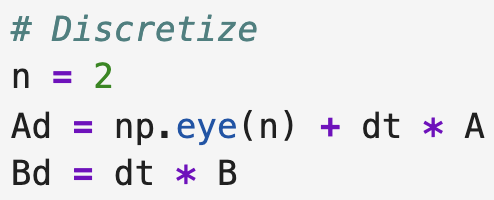

#### C matrix 

I initialized C as $C = \begin{bmatrix} 1 & 0 \end{bmatrix}$. I chose to use the sign convention where moving away from the wall is positive and moving towards the wall is negative. 

#### State vector

Since the ToF values are measured when the car is already in motion, v0 is non negative.

$$x_0 = \begin{bmatrix} 4367 \\ -4037.037 \end{bmatrix}$$

#### Process noise and sensor noise 

For the process noise, I estimated 

$$\sigma_1 = \sigma_2 = \sqrt{\frac{100}{dt}}=38.5$$

$$\Sigma_u = \begin{bmatrix} 1482.618 & 0 \\ 0 & 1482.618 \end{bmatrix}$$

From Lab 3, I measured the standard deviation for long mode to be 1.8mm. Therefore my initial guess of the sensor noise covariance is: 

$$\sigma_3=\sqrt{\frac{100}{dx}}=7.45$$

$$\Sigma_z = \begin{bmatrix} 55.556 \end{bmatrix}$$

### Test Kalman Filter in Jupyter 

The KF filter is applied as such:

  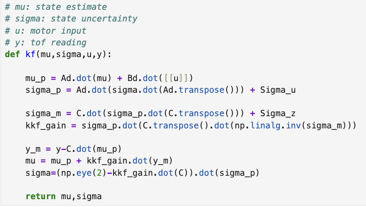

And is called for every timestep.

  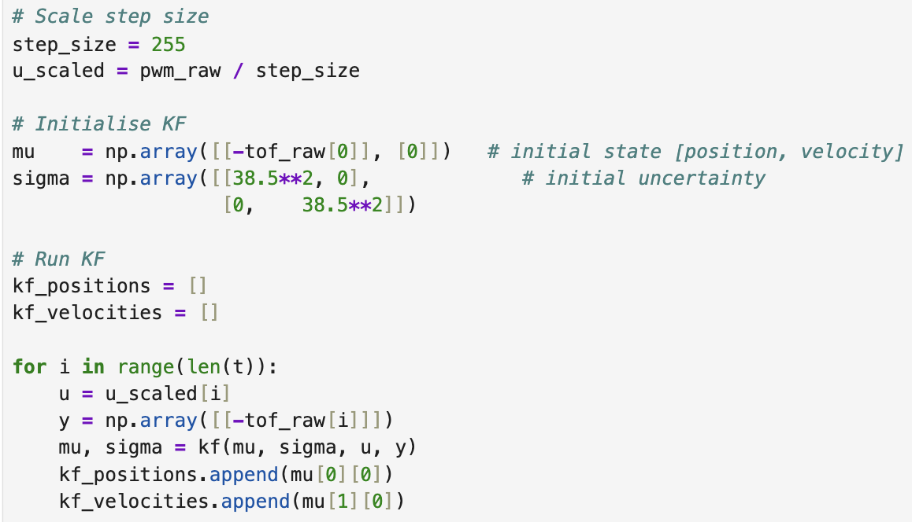

The initial set of covariances gave a KF that tracked the raw readings exactly, which signalled that the KF trusts the measurements too much relative to the model. As such, I increased $\sigma_3$ and decreased $\sigma_1$ and $\sigma_2$. 

  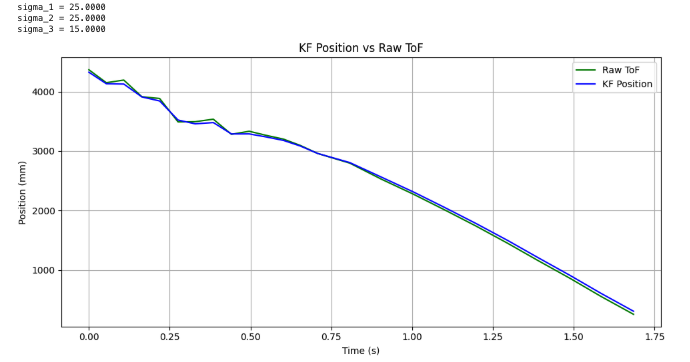

I continued tuning the ratio of the covariances. Particularly, I looked at how the filter tracked the initial ToF values which I knew were quite noisy, as the car was more than 4m away from the wall. The KF should smooth out any large jumps in measurements here. Secondly, I looked at how the KF performs towards the end where speed reaches steady state. I did not want the filtered values to vary much from the readings, which I knew were more reliable here. 

Finally, I obtained the best result for these set of covariances:

  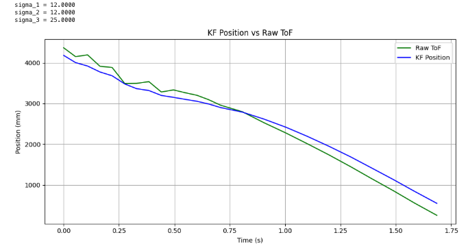

### Implementation of KF on Robot

Following the matrices obtained from tuning, I implemented the KF in Arduino. Since my PID values were tuned for ToF in short mode, I had to update my A and B matrices too for a smaller dt. 

Another fix was to change the units of d and m to be in mm (and hence change B), because I wanted my prediction step to return position and velocity in mm. 

$$A_{(short)} = \begin{bmatrix} 0 & 1 \\ 0 & -1.36 \end{bmatrix}, \quad B_{(short)} = \begin{bmatrix} 0 \\ 8009.6 \end{bmatrix}$$

I implemented the Kalman Filter on the Arduino as followed:

  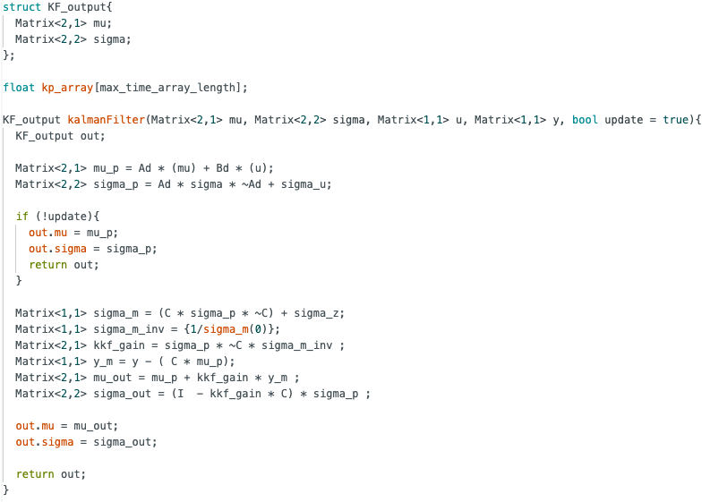

I added an update flag that decides if the kalman filter should run a prediction or an update step when called. In the main loop, the KF is called on every iteration. 

  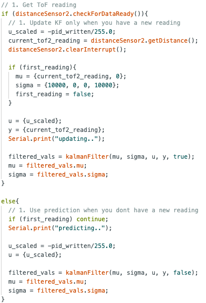

I added a negative sign in front of input u_scaled, because a positive PID means the robot is moving towards the wall, which is a negative velocity in my sign convention. 

### ToF testing for KF

The first test I did was to set PID gains to 0, and waved my hand in front of the ToF. The KF gives a smooth curve when changes in distance are small, but when my hand is far away, the ToF readings become unreliable and noisy. The KF accounts for this by not fully trusting large sudden jumps, instead weighing them against the model prediction, resulting in a more conservative position estimate.

  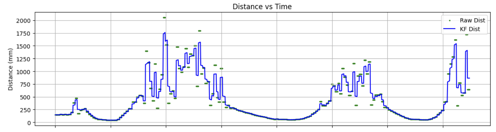

### PID testing with KF

As such, I went on to implement the KF for PID control. I set 4 different setpoints in a run: 200mm, 1000mm, 500mm, and 1500mm.

  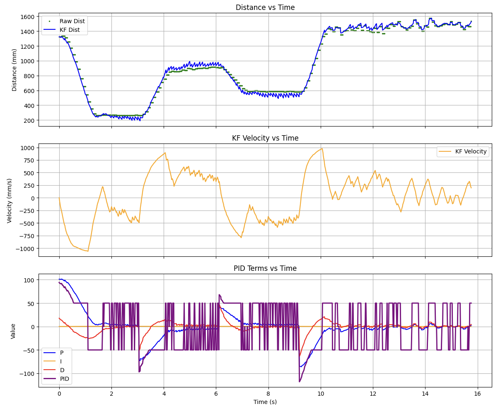

We observe that the predictions from the Kalman filter are very smooth when the car is accelerating, but becomes choppy when it is close to it. This is expected, because our KF is built around a non-zero PWM of 130. As such, when the PID output is small near the setpoint, the model no longer accurately describes the robot's dynamics and the filter deviates. 

The velocity prediction made by the KF is also very accurate when the robot is moving: it measures peak speeds of about 1m/s, which is what I observed in real time. 

Finally, the PID graph is smooth when the car accelerates, due to continuous distance values from the KF. P and D terms smoothly ramp up and down. The spikes of -50 to 50 occur due to the KF becoming choppy near the setpoint, and because I set the motor deadband to be 50 so any PWM value below that is boosted to 50.

A video of my car running on KF values is shown below:

  <iframe width="560" height="315"
    src="https://www.youtube.com/embed/H45y4GrIBUw"
    title="Stunt"
    frameborder="0"
    allowfullscreen>
  </iframe>

The car sounds a lot smoother thanks to the continuous PID value being fed to the motors!

### References 
I referenced both Jack Long's and Stephan Wagner's implementation of the Kalman Filter on Arduino. Thank you!

