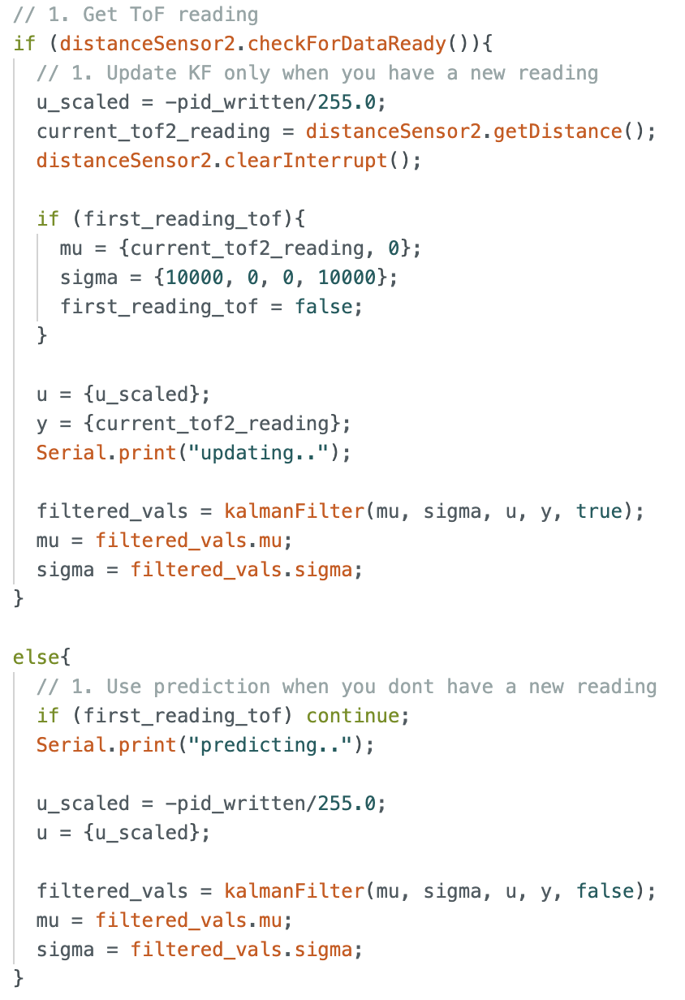
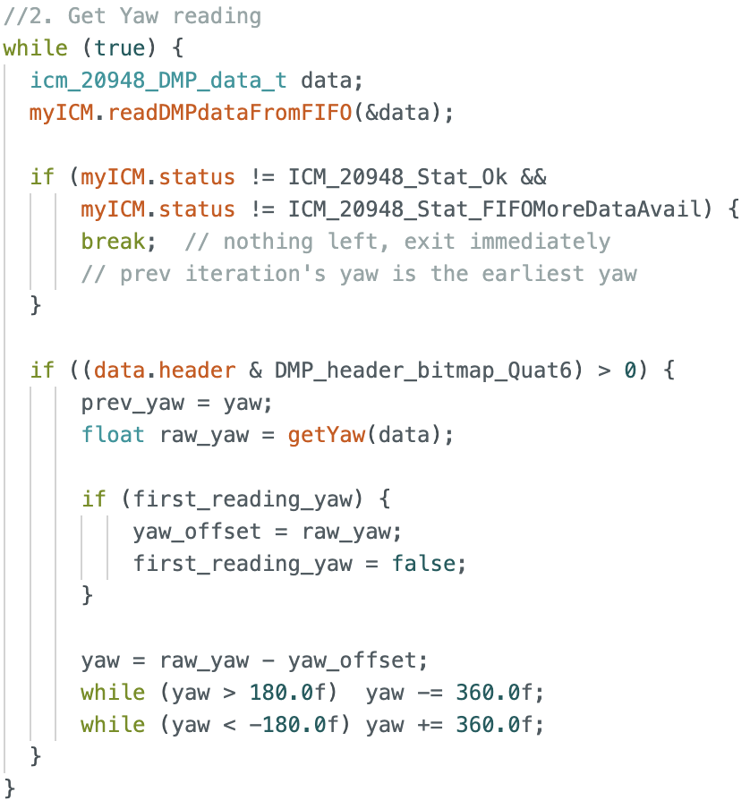
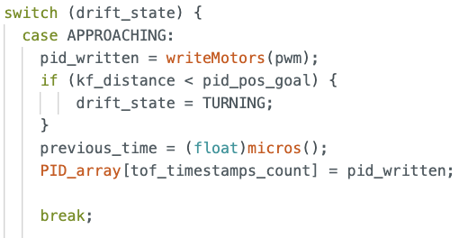
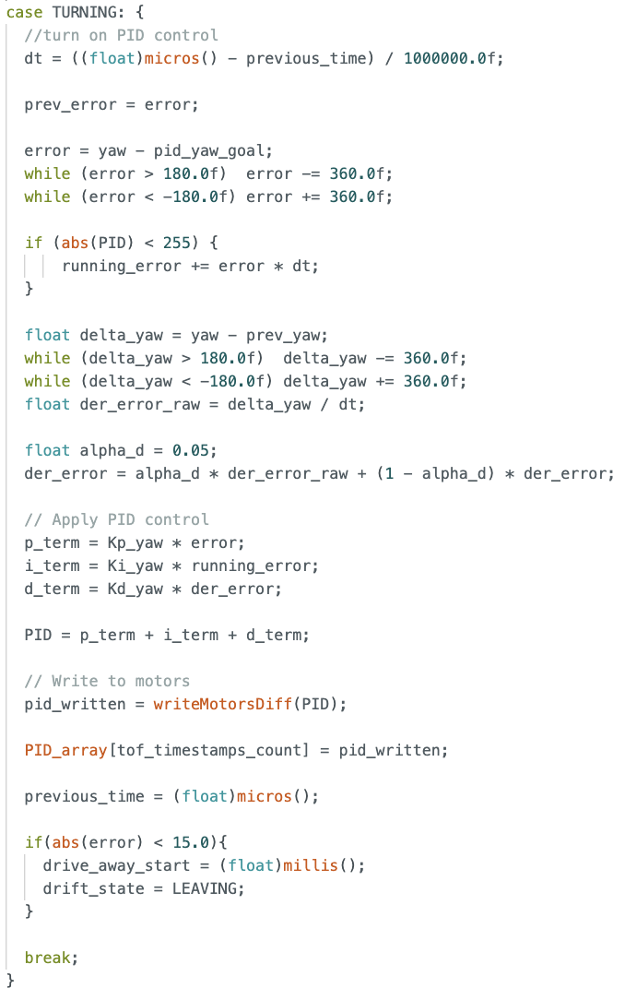
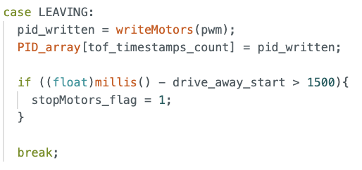
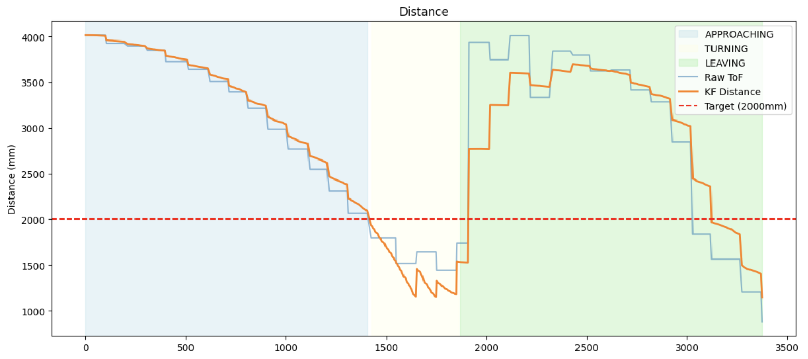
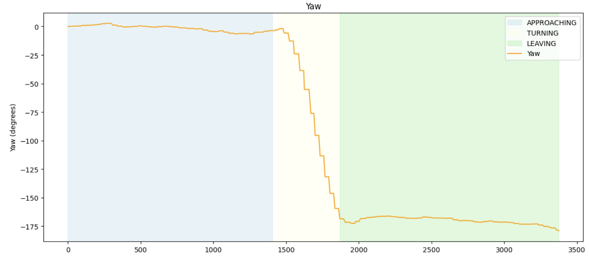
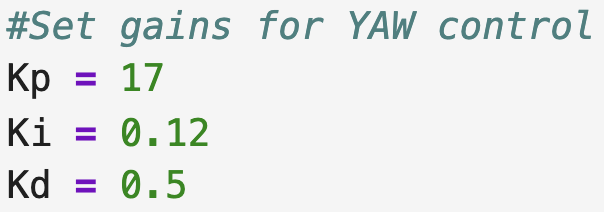
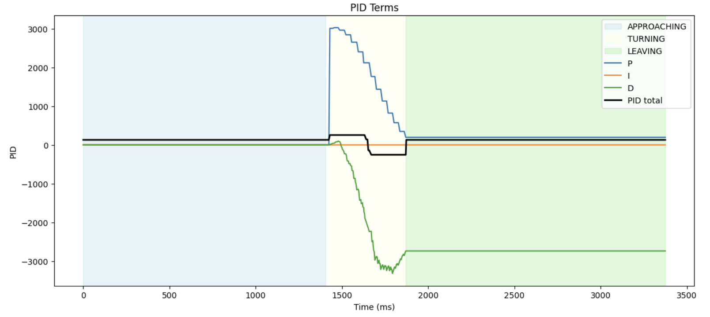

### Prelab
In this lab, I got my robot to perform a drift. This required distance measurements, which I used a Kalman Filter for, as well as yaw measurements which I used a Digital Motion Processor for. 

In Lab 7, I implemented a kalmanFilter() function that takes in a update flag. If there is a new sensor reading, we run both the prediction and update step. Otherwise, we run the prediction step. This function is used in my DRIFT command, as shown below:

  

I used the ToF long mode for this lab. One change I had to make for the KF filter was to update the discrete A and B values for the new sample rate of 258Hz for my control loop. 

$$A_d = \begin{bmatrix} 1 & 0.005 \\ 0 & 0.993 \end{bmatrix}, \quad B_d = \begin{bmatrix} 0 \\ 40.0 \end{bmatrix}$$

Similarly, I utilised the DMP for yaw values. One change I made was to add a yaw_offset value, so that the initial pose of the robot when the DRIFT command is called would be taken as 0 degrees no matter how the DMP was initialised at start up. 

  

With these sensor readings in place, we can move on to implementing the drift stunt.  

### Stunt: Drift

I broke down the stunt into 3 main parts: the initial approach from 4m away from the wall, 180 degree turn 914mm away from the wall, and driving away once the turn is complete. 

This series of actions is well-suited to a state machine, as such I implemented one on the Artemis. 

#### Approaching 

  

The APPROACHING state is entered immediately on setup. The motors are set to 130 so the car moves towards the wall, and we compare the calculated kf distance to the goal distance. If we are within the turning distance, we transition to the next state, TURNING. 

#### Turning 

  

The TURNING state runs the yaw PID control, similar to what was done in lab 6. The goal angle is set to 180 degrees. A ±15 degree tolerance band is applied to prevent the controller from jittering excessively around the target. Within ±15 degrees of the goal angle, we move to the next state, LEAVING. 

#### Leaving

  

In the last state, we set the PWM to 130 for 1.5 seconds and have the car drive away from the wall. 

### Results  
I recorded the distance and yaw measurements, as well as motor outputs. Through experimentation, a goal distance to 2 meters gives the robot more time to react. 

#### Distance Measurement   

  

The orange line shows the Kalman filter distance estimates, which are noticeably smoother than the raw ToF values (light blue). Between ToF samples, the Kalman filter provides continuous distance predictions, allowing the robot to start turning earlier than if it relied solely on the raw ToF measurements.

#### Yaw measurement

  

The Yaw measurments show that the robot turns fairly quickly. It completes the 180 degree turn with barely any overshoot within 0.44 seconds. 

#### Yaw PID

  

A different set of PID gains was used compared to Lab 6. Kp was increased significantly to ensure the robot turns aggressively, while Ki and Kd were reduced. Since the ±15 degree tolerance band means the robot only needs to get in the ballpark of 180 degrees before moving on, exact precision was not a priority here.

  

PID control in the APPROACHING state is turned off, so all values are 0.

We observe a large peak in the P-term (~3000) at the start of the turn due to the large error from the 180 degree target that ramps down steadily as the robot turns. We want this peak so as to achieve fast turning. 

The D-term spikes negative and deep (~-3400) due to the rapid change in yaw, which helps to prevent overturning. 

The I-term remains near zero as Ki was set very low, since the large Kp already drives fast turning and hitting exactly 180 degrees was not necessary. All values are clamped -255 to 255. 

#### Final stunt!
The video below shows 3 successful drift runs, and a slow mo. 

  <iframe width="560" height="315"
    src="https://www.youtube.com/embed/ZswjUY57PZ4"
    title="Stunt"
    frameborder="0"
    allowfullscreen>
  </iframe>

