

In this lab, we use our robot and sensors to create a map of a lab space. 

### Control

To make the car perform on-axis turns in small increments, I implemented orientation control using the Lab 6 PID controller. The controller responds well to small changes in angle, making it suitable for this task. 

I chose to perform 36 readings every full rotation, so I run a while loop with the target angle increasing by 10 degrees each loop. 

  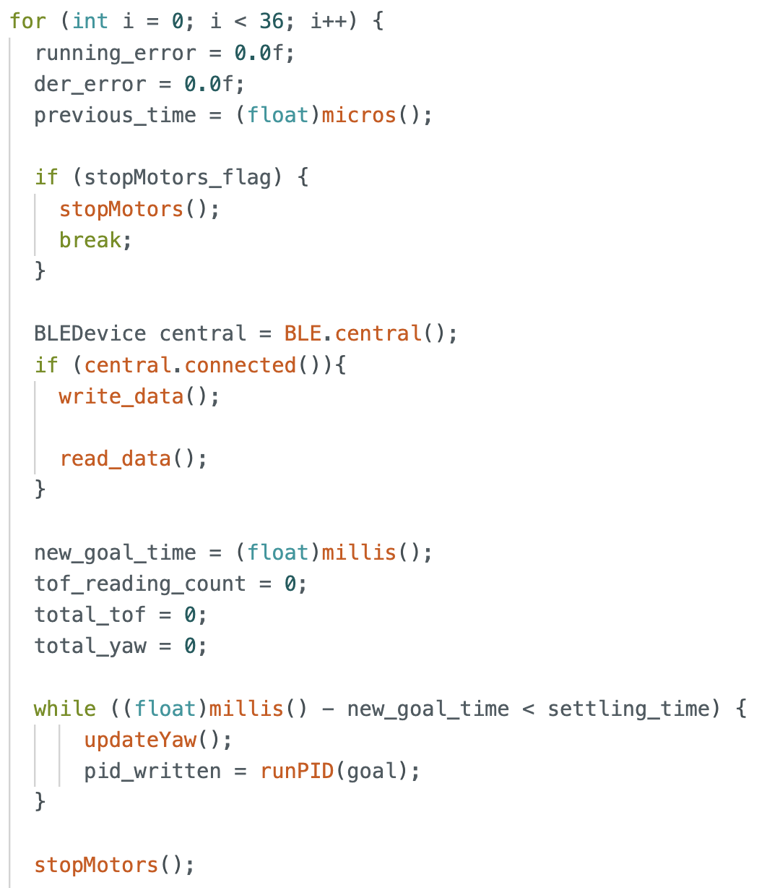

For each loop, the PID runs for 2.5 seconds for the robot to settle at the target angle. To prevent the robot from moving rapidly when ToF readings are being taken, we stop motors. 

  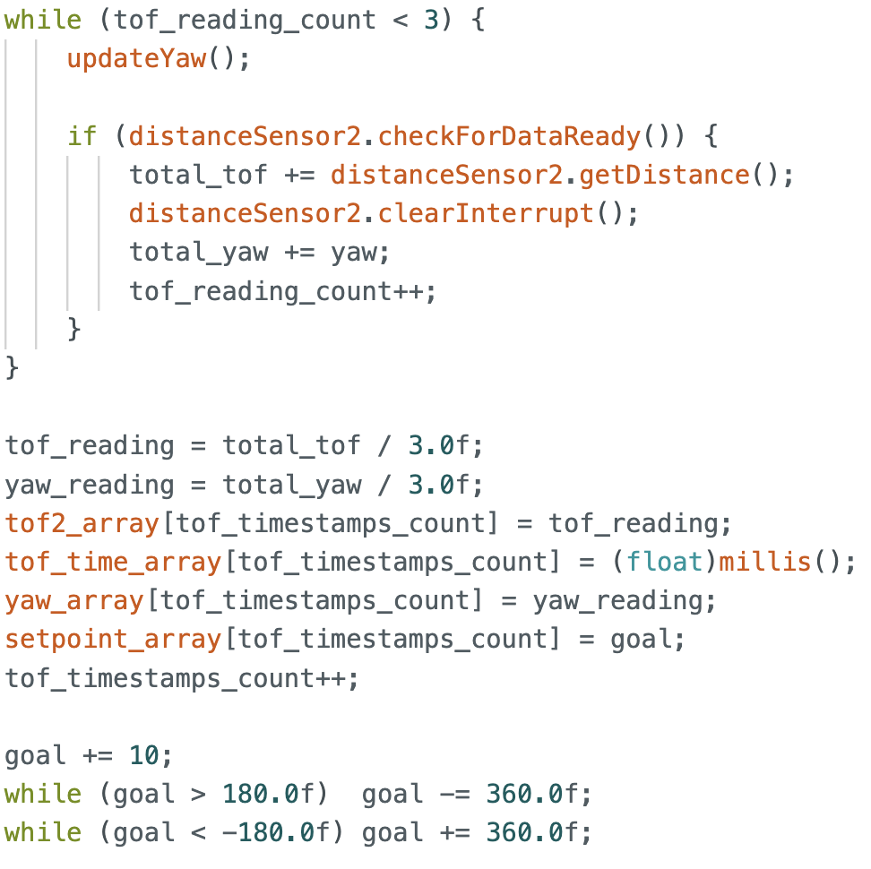

At each target angle, we take 3 readings and record the average yaw and ToF values to increase reliability. 

Below is a video of the robot turning on axis and taking measurements.

  <iframe width="560" height="315"
    src="https://www.youtube.com/embed/YX4LK8AQwlI"
    title="Stunt"
    frameborder="0"
    allowfullscreen>
  </iframe>

An example of the ToF and yaw values recorded at (0,0) is shown below:

  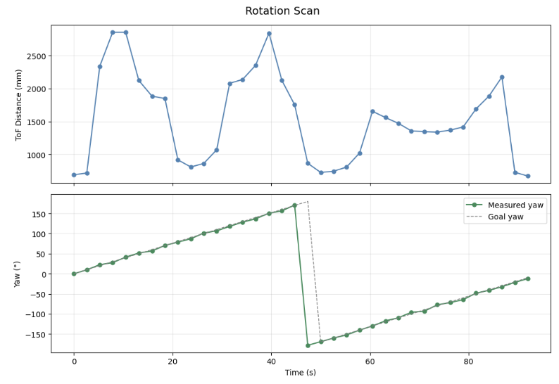

The yaw values match closely to the target angles (+180 and -180 are the same point). The mean absolute error is 1.83° and maximum error is 4.87°. However, the robot does not turn exactly on axis, often ending up a bit away from the starting point (marked by green tape in image below).

  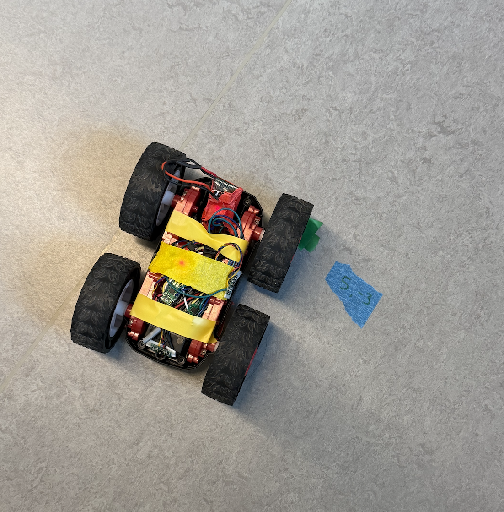

I found the maximum deviation to be at the end of the full rotation, which was about 12cm = 120mm. Given these error ranges, for a 4x4m room with diagonal length of 2.83m, the positional error ranges from ~9cm on average to ~24cm in the worst case due to angular uncertainty.  The off-axis drift adding up to an additional 12cm, bringing the total error to approximately 21–36cm.

### Read out Distances

I performed a rotation at 5 marked points in the lab space. A (very) rough sketch of the lab space setup is as follows:

  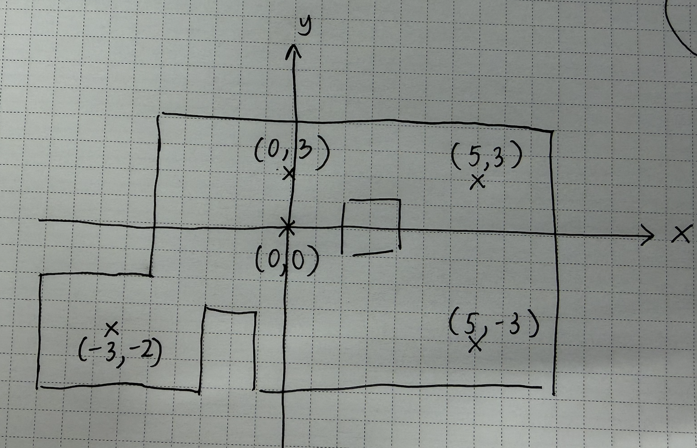

To make the mapping from robot coord-space to world coord-space easier, I positioned the robot with the ToF pointing in the same direction as the +x axis in world space, with this orientation corresponding to 0°.

The 5 polar plots obtained are shown below. They match the space closely.

  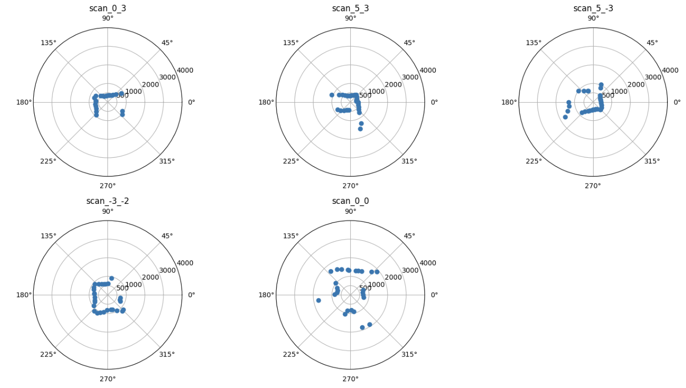

For precision, I took 2 sets of measurements at (0,0) and plotted them on the same polar graph. They match up pretty well and there is low variability in points.  

  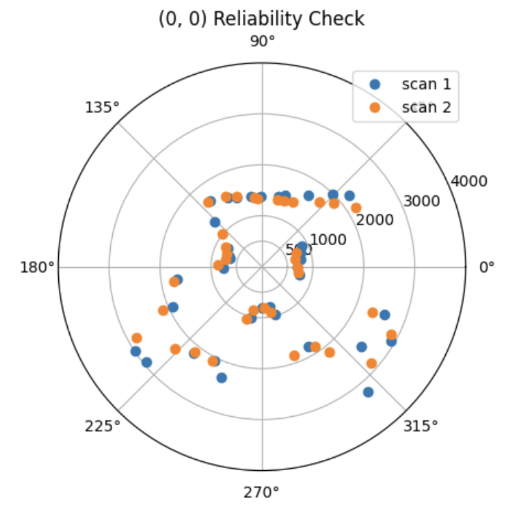

 

### Transformation Matrices 

The first transformation is from ToF frame to Robot frame. There is no rotation between the two frames, but the ToF is positioned 69mm from the center of the Robot. As such, we add 69 to all ToF readings to account for this frame change. Then, we can convert cartesian coordinates to coordinates in the Robot frame. 

  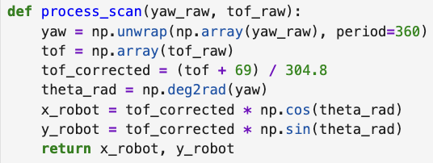

 

The second transformation is from Robot to World frame. As we ensured that the robot and world frame share the same axis orientation during data collection, the rotation matrix is the identity matrix (alpha = 0). We multiply each (x,y) coordinate in robot frame with the transformation matrix.

  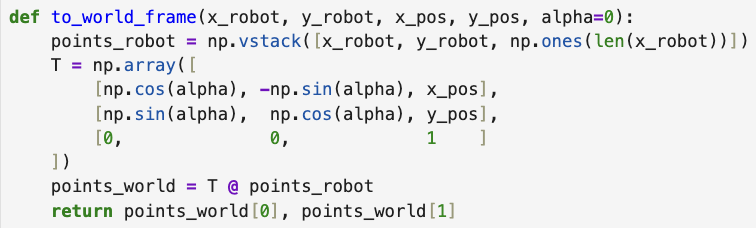

 

Using the functions above, we convert all scans to world frame coordinates, and plot them together. 

  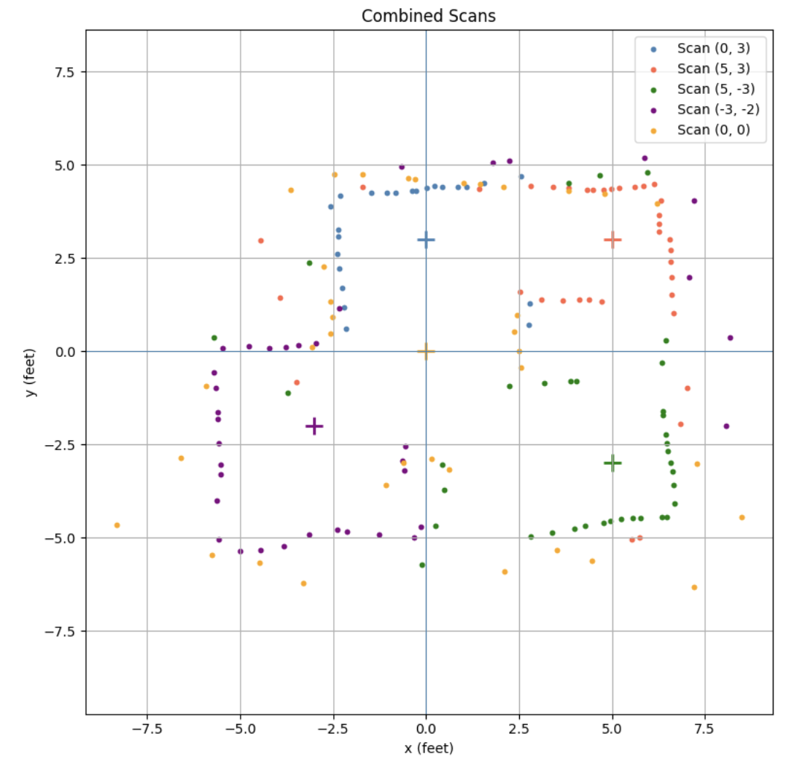

 

This gives a scan that is very similar to that of the lab set up. Drawing the approximate walls, and cleaning up any stray values > 3000mm, I get:

  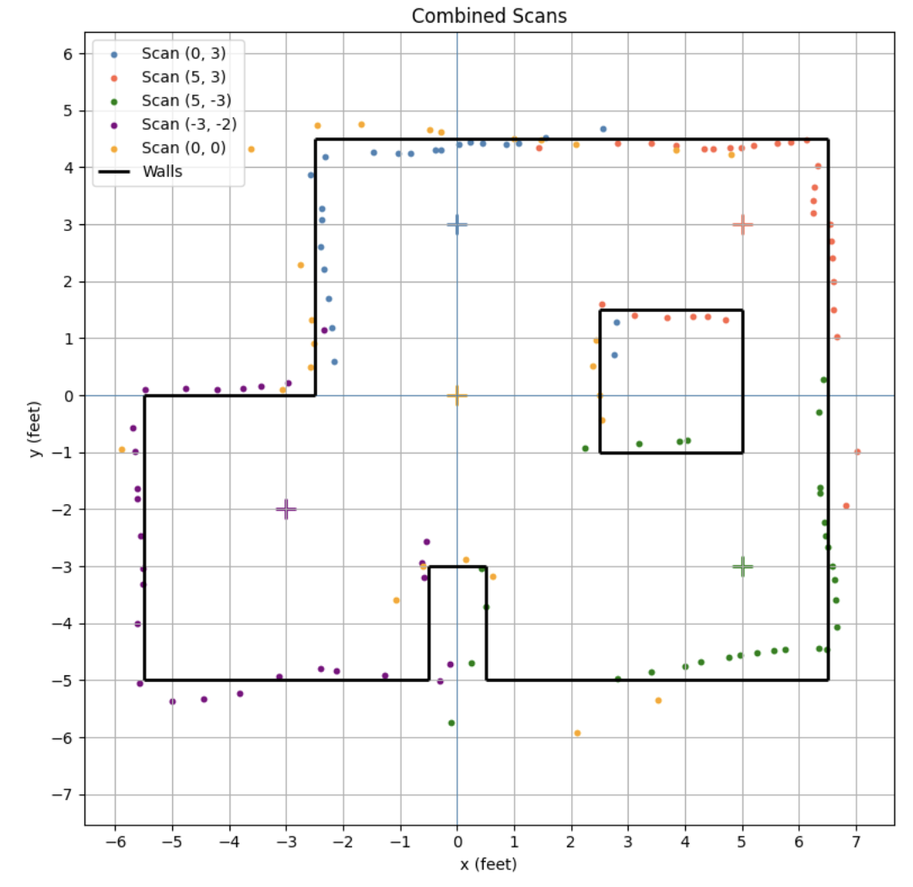

 

Which is quite similar to the lab space!

  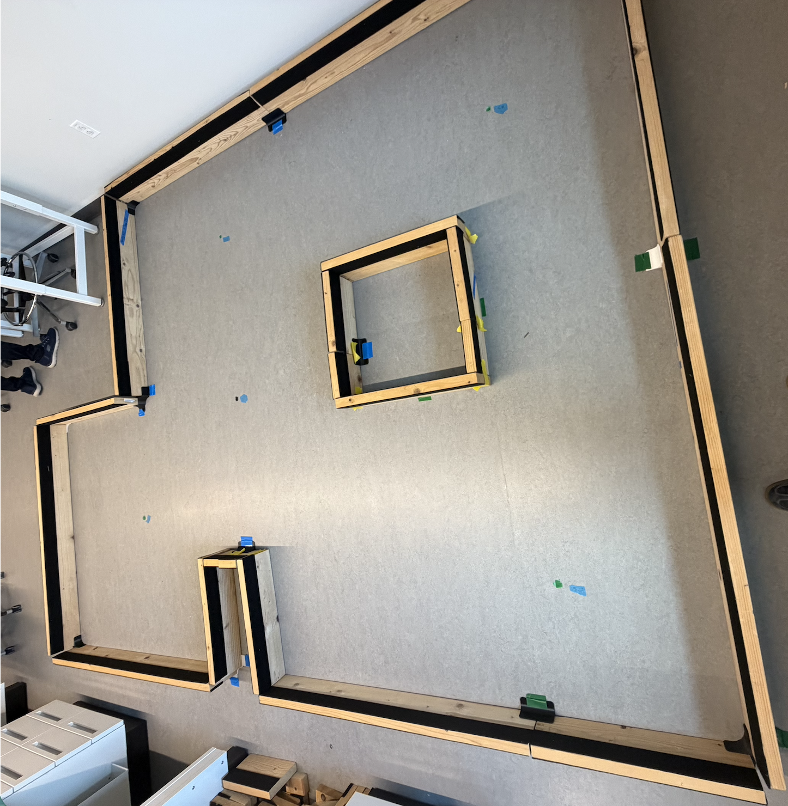

 

